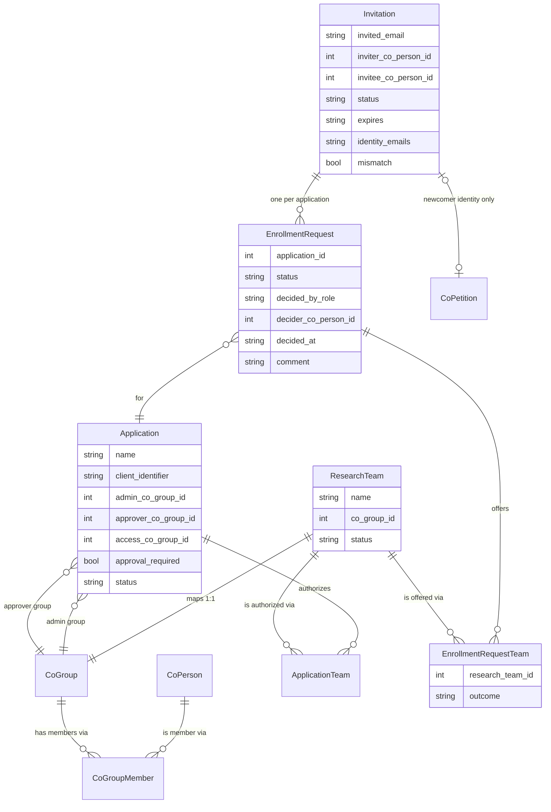
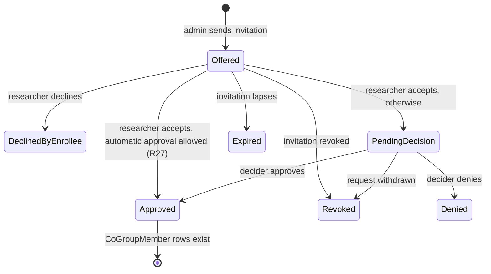

# ApplicationTeamEnroller - Plan

## Goal Capsule

- **Objective:** SD4H application administrators can bring a researcher onto one or more applications and research teams with one email invitation, and the researcher can log into those applications through CILogon with the right team claim once each application's decision is made. Every invitation, response, and decision is recorded for audit.
- **Means:** A COmanage Registry 4.6.x plugin named `ApplicationTeamEnroller`, delivered as a working v1 that SD4H staff can use and react to.
- **Product authority:** This Product Contract supersedes the design in `cilogon/drac-policies` `designs/2026-06-01-sd4h-application-enrollment-plugin-requirements.md` at commit `850ac9c`, which already folds in SD4H's edits from `bd0619c`, and adds SD4H's answers from the 2026-08-20 email. Where SD4H has not answered a question, this contract sets a default (listed under Dependencies / Assumptions) instead of waiting. SD4H feedback on the working plugin can change those defaults.
- **Open blockers:** None.

---

## Product Contract

### Summary

`ApplicationTeamEnroller` is an enroller plugin for COmanage Registry 4.6.x.
An application administrator invites a researcher by email to one or more applications, choosing research teams within each.
The researcher logs in through CILogon and accepts or declines each application.
Accepted applications go to that application's approvers, or are approved immediately when the application does not require approval.
Approval adds the researcher to the teams' CoGroups. Each application has a plugin-maintained access group that nests its teams' groups, so Registry's group provisioning delivers application login and the ID Token team claim.

### Problem Frame

SD4H runs about a dozen applications that researchers log into via CILogon, and more will come. Access to each application depends on membership in a research team, and a team can be authorized for several applications. Before a researcher can use an application, someone with authority must vouch that the person belongs to a research team. The application must also learn at login which authorized teams the person belongs to, so it can scope what they see.

Registry has no structure that links "application", "research team", and "the people responsible for who uses an application". Team membership, application authorization, and the team claim are all wired up by hand. That costs manual group administration for every person on every application, and leaves no record of who invited whom, who consented, or who approved.

At SD4H, onboarding starts with the administrator. The application administrator knows about a researcher joining a project before the researcher knows which applications or teams exist. SD4H reviewed an earlier self-service design and replaced it with administrator invitation. They have also said how to handle mistyped addresses, identity email mismatches, and people who are already CO members.

SD4H has left several questions open. The project will answer them by putting a working plugin in front of SD4H staff, not by further abstract design review.

---

### Key Decisions

- **Enrollment is started by the administrator, and researchers have no self-service path.** SD4H chose this in their review; the researcher never browses applications or asserts team membership. Governs R12, R13.
- **The authorization primitive is `CoGroupMember` on a research team's CoGroup.** A team membership grants login to every application that authorizes the team and supplies the team claim, so its effect is CO-wide. Approval through one application therefore grants every application that shares the team, and automatic approval is allowed only when none of those applications requires approval. Governs R26, R27, R31, R32.
- **`ResearchTeam` maps one-to-one to a `CoGroup`, using the UnixCluster plugin's `cmPluginHasMany` technique.** Membership then rides existing LDAP/OIDC group provisioning, so the plugin needs no custom claim code. The plugin is not a `cluster`-type plugin. Governs R2, R6.
- **Each application's login gate is an access group the plugin maintains by nesting its authorized teams' groups.** CILogon's OIDC client configuration (the Oa4mpClient plugin) accepts one authorization group per client and cannot filter the `isMemberOf` claim, so a nested access group is the only way the plugin's application-to-team mapping reaches login. People are never added to it directly. Governs R31, R32.
- **One invitation spans many applications, and each application is decided on its own.** A researcher gets one email; each application gets its own consent and its own decision, so mixed outcomes are normal. Governs R10, R17, R30.
- **The plugin owns invitations, and no person record exists until it is needed.** An invitation lives only in plugin records. An existing member responds with no petition. A newcomer who accepts at least one application goes through an identity-only enrollment flow that creates their `CoPerson`. (session-settled: user-approved -- chosen over Registry's native `CoInvite` invitation: the native flow creates person records at send time and merges duplicates afterwards, which contradicts SD4H's rule to check before creating anything new.) Governs R14, R19, R20, R21.
- **Admins compose invitations on a plugin screen, not inside an enrollment flow.** A petition started by an admin would need an enrollee record before the researcher has responded. (session-settled: user-approved -- chosen over composing inside an admin-run enrollment flow, as `850ac9c` R7 had it: incompatible with plugin-owned invitations.) Governs R9.
- **An identity mismatch is never resolved automatically.** Following SD4H, a mismatch goes to a person who decides, and approval proceeds only if they approve. Governs R22, R23.
- **When approval is off for an application, the inviting admin decides mismatches for it.** (session-settled: user-directed -- chosen over forcing the approver step, routing to CO administrators, or blocking the response: keeps an application with approval off self-contained within its own administrators.) Governs R24.
- **Where SD4H has not answered, the plugin ships with defaults.** SD4H will get better answers by reacting to a working plugin than to more design review. (session-settled: user-directed -- chosen over pausing design and development until SD4H answers the open questions: SD4H can react to working software.) Each default is a setting or an easy change. See Dependencies / Assumptions.
- **The plugin is named `ApplicationTeamEnroller` and is not tied to SD4H.** Nothing in the design is specific to SD4H, and the name follows the CILogon convention of a CamelCase name ending in `Enroller`, with the repository named after the plugin directory. (session-settled: user-approved -- chosen over `Sd4hApplicationEnroller`, `TeamInvitationEnroller`, and `DracApplicationEnroller`: the design is reusable by other COs.)
- **All text is English and translatable.** Every string goes in the plugin's language file, so French can be added later without code changes. (session-settled: user-approved -- chosen over shipping English and French in v1: halves the text to write and review now.) Governs R38.

---

### Actors

- A1. **Researcher (invitee)** -- receives an invitation by email, logs in via CILogon, and accepts or declines each offered application.
- A2. **Application administrator** -- a member of an application's admin group; composes invitations for the applications they administer, sees their status, revokes their own invitations, and decides mismatches for applications that do not require approval.
- A3. **Application approver** -- a member of an application's approver group; approves or denies accepted requests for that application.
- A4. **CO administrator** -- configures applications, research teams, the application-to-team mapping, admin and approver groups, the approval setting, and plugin settings; can see and revoke any invitation.
- A5. **Application (OIDC client)** -- consumes the team claim at login and scopes the session.
- A6. **Registry provisioning and CILogon** -- provisions `CoGroupMember` (including nested membership) to `isMemberOf`, gates each client on its authorization group, and releases group membership as the team claim.

---

### Data Model

The model names below are what the design assumes; planning may rename them.

- `ApplicationTeam` controls which teams an admin may offer for an application and which team groups are nested into the application's access group (R31). It grants no membership to anyone.
- `Invitation.status`: `sent`, `responded`, `revoked`, `expired`.
- `EnrollmentRequest.status`: `offered`, `declined_by_enrollee`, `pending_decision`, `approved`, `denied`, `revoked`, `expired`.
- `EnrollmentRequestTeam.outcome` records, per team, whether a membership was added, was already present, or was skipped because the application no longer authorizes the team (R29).
- Access itself is only ever `CoGroupMember` rows. The plugin's records are the audit trail.

---

### Key Flows

- F1. Compose and send an invitation
  - **Trigger:** An application administrator opens "Invite researcher" from the plugin menu.
  - **Actors:** A2, A1
  - **Steps:** The admin sees only the applications they administer, picks one or more, and picks teams for each from that application's authorized research teams. They enter the researcher's email address and send. The plugin records the invitation, creates one request per application, and emails the researcher a single link.
  - **Outcome:** One `sent` invitation with one `offered` request per application.
  - **Covered by:** R9-R16

- F2. Researcher responds
  - **Trigger:** The researcher follows the link and logs in via CILogon.
  - **Actors:** A1
  - **Steps:** The plugin checks that the invitation is live and runs the identity checks (R22). The researcher sees each application with its teams and accepts or declines each one. An existing member's response is recorded directly. For a newcomer who accepted at least one application, the plugin runs the configured identity-only enrollment flow to create their `CoPerson`, then links it to the invitation. Each accepted request becomes `approved` (automatic approval allowed by R27) or `pending_decision`. Deciders are notified.
  - **Outcome:** The invitation is `responded` and the link stops working. For a newcomer, this happens only once the enrollment flow completes (R21).
  - **Covered by:** R17-R25

- F3. Decide a request
  - **Trigger:** A decider opens the plugin's decision queue.
  - **Actors:** A3, A2 for a mismatch on an application with approval off, or A4 at any time (R24)
  - **Steps:** The decider sees the pending requests they are allowed to decide, each with the details listed in R25. They approve or deny, optionally with a comment. Approval adds memberships (R26-R29). The researcher gets an email with the outcome.
  - **Outcome:** The request is `approved` or `denied`. Other requests on the same invitation are unaffected.
  - **Covered by:** R25-R30, R35

- F4. Login and claim
  - **Trigger:** The researcher logs into application A via CILogon.
  - **Steps:** CILogon permits the login if the researcher is in A's access group, which contains every team A authorizes through nesting. The ID Token carries the researcher's groups, and A scopes the session to the teams it authorizes.
  - **Covered by:** R31, R32

---

### Requirements

**Configuration**

- R1. CO administrators can create, edit, and retire applications. Each application has a name, an optional OIDC client identifier, an admin CoGroup, an approver CoGroup, and an approval-required setting. There is no limit on how many applications a CO can have.
- R2. CO administrators can designate an existing CoGroup as a research team. Each team maps to exactly one CoGroup, and team membership is represented only by `CoGroupMember` rows on that group.
- R3. CO administrators can authorize any number of research teams for each application, and any team for any number of applications.
- R4. An application's admin and approver groups are existing CO groups that the plugin references and never creates. They may be the same group.
- R5. Per-CO plugin settings hold the invitation lifetime (default 14 days), the invitation email subject and body (a default text ships with the plugin), and the enrollment flow used for newcomers.
- R6. The plugin is an `enroller`-type plugin that also provides its own management screens. It does not register or behave as a `cluster`-type plugin.

**Records**

- R7. Each invitation is recorded durably: invited address, inviting admin, resolved `CoPerson` once known, emails the login identity reported, mismatch flag, expiry, and status.
- R8. Each per-application request is recorded durably: application, offered teams, the researcher's response, the decision, who made it and in which role (approver, inviting admin, CO administrator, or automatic), when, and any comment. The record also shows the outcome for each team.

**Composing an invitation**

- R9. Application administrators compose invitations on a plugin screen reachable from the Registry menu.
- R10. One invitation may cover several applications, with one or more teams for each. One request is created per selected application when the invitation is sent.
- R11. An administrator may select only the applications whose admin group they belong to. CO administrators may select any application.
- R12. For each selected application, the team list contains only research teams authorized for that application and never plain CoGroups such as `CO:admins`.
- R13. The researcher does not choose applications or teams. They only accept or decline what the admin offered.
- R14. Sending an invitation creates no `CoPerson`, OrgIdentity, or petition.
- R15. The researcher receives exactly one email per invitation, containing a single link to respond.
- R16. Several live invitations to the same address are allowed and are handled independently.

**Invitation lifetime**

- R17. An invitation expires when the configured lifetime has passed. On expiry, its unanswered requests become `expired`.
- R18. The inviting admin or a CO administrator can revoke an invitation before the researcher responds, which marks its requests `revoked`. They can also withdraw a single `pending_decision` request, which marks it `revoked`. Resending means revoking and sending a new invitation. The link works for a single response only; after a response, revocation, or expiry it shows an explanatory page.

**Responding**

- R19. Responding requires logging in via CILogon. The researcher sees every offered application with its teams and accepts or declines each independently. A researcher decline is recorded as distinct from a decider's denial. After responding, the researcher sees a confirmation page listing each application's resulting state (approved, awaiting a decision, or declined), with no mismatch details.
- R20. A researcher is an existing member when their login identity is already linked to a `CoPerson` in the CO. Their response is recorded against that `CoPerson` with no petition and no new person record.
- R21. For a researcher who is not an existing member, a `CoPerson` is created only if they accept at least one application. It is created through the configured identity-only enrollment flow from their CILogon identity, and gets the email their identity reports, not the invited address. If they decline every application, no person record is created.
  - A newcomer's response is committed, and the link used up, only when the enrollment flow completes and the new `CoPerson` is linked to the invitation. Until then the invitation stays `sent` and the link can be used again.
  - The plugin's step in that flow stops any petition that does not carry a live invitation with at least one accepted application from the same login, so the flow cannot be used to enroll without an invitation.
  - When the invited address belongs to an existing `CoPerson` but the login identity is linked to no one, no `CoPerson` is created at response time and accepted requests become `pending_decision` (R22). Approval links the login identity to that existing `CoPerson` and adds the memberships there; denial creates nothing.
- R22. At response time, the invitation is flagged as a mismatch in either of these cases:
  - The invited address, compared case-insensitively, is not among the emails the login identity reports. This includes an identity that reports no email.
  - The invited address belongs to a different existing `CoPerson` than the responder.
- R23. An accepted request on a flagged invitation is never auto-approved. It becomes `pending_decision` and shows the mismatch to its decider.
- R24. The decider for a pending request is the application's approver group. When the application has approval off and the request is pending only because of a mismatch, the decider is instead the inviting admin, or any member of the application's admin group if the inviting admin is no longer in it. A CO administrator who sent an invitation is its inviting admin. CO administrators can decide any pending request.
- R25. The decision queue lists only the requests the current user may decide. Each shows the researcher, invited address, emails from the login identity, mismatch flag, inviting admin, application, and teams. Approve and deny each accept an optional comment. The plugin enforces that only the eligible decider can act.

**Authorization**

- R26. On approval, the plugin adds a `CoGroupMember` row for the researcher on each offered team's CoGroup where none exists. A team the researcher already belongs to resolves as already-authorized with no duplicate row.
- R27. An accepted request with no mismatch is approved immediately with the effect of R26, and its decider recorded as automatic, only when its application and every other application that authorizes any of its offered teams have approval off. Otherwise it becomes `pending_decision`.
- R28. Denial creates no memberships for that application's teams.
- R29. At approval time, a team that the application no longer authorizes, or that is no longer a research team, is skipped and recorded as skipped. The other teams are still added.
- R30. Requests from one invitation are decided independently. An invitation can end with a mix of approved, denied, declined, and expired requests.
- R31. The plugin creates and maintains an access CoGroup for each application, containing the CoGroup of every research team the application authorizes as a nested group, and keeps the nesting in step with the application-to-team mapping. A CO administrator configures that access group as the application's OIDC client authorization group. People are never added to an access group directly.
- R32. The team claim comes from CoGroup membership through existing provisioning and carries all of the researcher's groups; each application filters it to the teams it authorizes. The plugin does not implement claim release.
- R33. In v1, researchers are removed from teams through Registry's native group membership management. The plugin has no removal screen.

**Visibility and notifications**

- R34. An application administrator can list invitations that include applications they administer, with the status of each request. CO administrators can list all invitations.
- R35. When a request becomes `pending_decision`, its eligible deciders receive a Registry notification, which Registry delivers in the app and by email. The notification is resolved when the request is decided.
- R36. The researcher receives one email for each application decision (approved, denied, or automatic approval). A decider's comment is kept for audit and is not sent to the researcher.
- R37. The inviting admin is notified when a request on their invitation is decided or when the invitation expires unanswered.

**Localization**

- R38. All user-facing text, including the default email text, is in the plugin's language file in English.

---

### Acceptance Examples

- AE1. **Covers R11, R12.** Given admin X administers A but not B, and A authorizes T1 and T2, when X composes an invitation, then only A is selectable and its team list shows T1 and T2 with no administrative groups.
- AE2. **Covers R10, R15, R19, R30.** Given an invitation for A, B, and C, when the researcher accepts A and C and declines B, then they received one email, B records `declined_by_enrollee`, and A and C proceed independently.
- AE3. **Covers R19, R30.** Given the researcher declined B, when A's approver approves and C's approver denies, then the three requests record `approved`, `declined_by_enrollee`, and `denied`, and the audit record tells each apart.
- AE4. **Covers R14, R20, R26.** Given an existing member whose login identity is linked to their `CoPerson` and who is not in T1, when they accept A offering T1 and A's approver approves, then no petition runs, no `CoPerson` is created, and `CoGroupMember(member, T1)` is added. There was no membership between acceptance and approval.
- AE5. **Covers R21.** Given a researcher with no `CoPerson` in the CO, when they decline every application, then no `CoPerson` is created. When they accept at least one application instead, then exactly one `CoPerson` is created through the configured enrollment flow.
- AE6. **Covers R27.** Given C has approval off, when a researcher whose identity reports the invited address accepts C, then C's team memberships are added immediately and no one is asked to decide.
- AE7. **Covers R22, R23, R24.** Given C has approval off and admin X invited `pat@uni.ca`, when the researcher logs in with an identity reporting only `pat@gmail.com` and accepts C, then C becomes `pending_decision` with the mismatch shown, and only X can decide it.
- AE8. **Covers R22, R24.** Given an invitation for A (approval required) and C (approval off) is flagged as a mismatch, when the researcher accepts both, then A's request goes to A's approvers and C's request goes to the inviting admin, and each is decided on its own.
- AE9. **Covers R22.** Given the invited address is on existing `CoPerson` P1, when the researcher responds with a login identity linked to `CoPerson` P2, then the invitation is flagged as a mismatch.
- AE10. **Covers R26.** Given a researcher already in T2 through an earlier approval for A, when an invitation for B offering T2 is approved, then T2 is recorded as already present and no duplicate row is created.
- AE11. **Covers R29.** Given an invitation for A offering T1 and T2, when a CO administrator removes T2 from A before approval and the approver then approves, then T1 is added and T2 is recorded as skipped.
- AE12. **Covers R17, R18.** Given an invitation, when it is revoked or passes its expiry before a response, then its link shows an explanatory page and its requests are `revoked` or `expired`. A new invitation to the same address works normally.
- AE13. **Covers R25.** Given applications A and B with different approver groups, when a request for A is pending, then only members of A's approver group see it in their queue and can act on it.
- AE14. **Covers R31, R32.** Given a researcher is in T1 and T2, and A authorizes T1 but not T2, when they log into A, then the login succeeds through A's access group and A scopes the session to T1. When a CO administrator later removes T1 from A, then T1 is no longer nested in A's access group and the researcher can no longer log into A.
- AE15. **Covers R27.** Given T is authorized for C (approval off) and B (approval required), when a researcher accepts an invitation to C offering T with no mismatch, then the request becomes `pending_decision` for C's approver group instead of being approved automatically.
- AE16. **Covers R21, R22.** Given the invited address belongs to existing `CoPerson` P1, when the researcher responds with a new login identity linked to no one and accepts A, then no `CoPerson` is created. If A's approver approves, then the login is linked to P1 and the memberships are added to P1.
- AE17. **Covers R18, R24.** Given a request has been `pending_decision` with no action from A's approvers, when a CO administrator decides it or the inviting admin withdraws it, then it becomes `approved`, `denied`, or `revoked`.

---

### Success Criteria

- The plugin installs and runs on a COmanage Registry 4.6.x deployment and passes its automated tests.
- On a test Registry, SD4H staff can take one invitation end to end: configure applications and teams, send an invitation covering several applications, respond as both an existing member and a newcomer, decide requests including a mismatch, and log into an application that receives the expected team claim.
- Every product behavior an SD4H reviewer is likely to want changed is either a setting or confined to one requirement, so feedback turns into small changes.

---

### Scope Boundaries

**Deferred for later**

- A plugin screen for removing researchers from teams (R33). Removing a membership revokes access across every application that authorizes the team at once.
- French translation (R38).
- Reminder emails for invitations or pending decisions that have not been acted on.
- Per-client filtering of the team claim in CILogon (R32), which would spare each application from filtering its own claim.

**Outside this plugin's identity**

- Researcher self-service enrollment, where a researcher chooses applications or asserts a team. SD4H removed this path deliberately.
- Per-(application, team) access groups. Team membership is the only access primitive.
- `cluster`-type behavior, `ClusterInterface`, or account provisioning.
- OIDC/LDAP claim-release configuration and CILogon identity matching policy.

---

### Dependencies / Assumptions

**Platform**

- COmanage Registry 4.6.x. The enroller contract is unchanged from 4.5.0 to 4.6.0: the model sets `cmPluginType = "enroller"` and `belongsTo CoEnrollmentFlowWedge`, and the controller extends `CoPetitionsController` with `execute_plugin_<step>($id, $onFinish)`. Unimplemented steps redirect to `$onFinish`.
- `cmPluginHasMany` is keyed by core model name, not plugin type, so a non-cluster plugin can attach `ResearchTeam` to `CoGroup` the way UnixCluster does.
- Plugins can add menu entries through `cmPluginMenus` (as NamespaceAssigner and AnnouncementsWidget do), which supports the management and queue screens.
- CO administrators and group managers can already remove group members in Registry's UI, which is what R33 relies on.
- Registry's native flows cannot be used for this: a flow has a single, static approver group and authorization group, and native invitation processing never compares the invited address with the login identity.
- The Oa4mpClient plugin gives each OIDC client a single authorization group and releases `isMemberOf` without per-client filtering, which is why R31 uses a nested access group and R32 leaves filtering to the application. Registry 4.x supports nested groups (`CoGroupNesting`).

**Assumptions**

- The SD4H CO has, or can be given, an authenticated enrollment flow that builds a `CoPerson` from the CILogon login. The plugin attaches to that flow for newcomers (R21).
- The CILogon login exposes the identity's email addresses to Registry at response time, so R22 can compare them.
- A logged-in user with no `CoPerson` in the CO can reach the plugin's response page.

**Defaults SD4H has not confirmed**

Each of these is live in v1 and changes with a setting or within the one requirement named:

- Invitation lifetime of 14 days (R5).
- Admin and approver groups may be the same group (R4).
- An application may have approval turned off (R1, R27).
- For a mismatch on an application with approval off, the inviting admin decides (R24).
- Removal happens only through native group management (R33).
- English only (R38).

**Open for SD4H**

- What an approver checks beyond the admin's choice, and whether approver authority should belong to the research team rather than the application. Today approval through one application grants every application that shares the team (R27 limits only automatic approval).

---

### Outstanding Questions

**Deferred to Planning**

- How the response page serves a logged-in user who has no `CoPerson` yet, and how it hands a newcomer into the configured enrollment flow while carrying the invitation, then links the resulting `CoPerson` back. The flow's match policy `Self` only links an existing `CoPerson`, so the newcomer path needs another mechanism.
- Where the login identity's email addresses are read from at response time (session/environment attributes versus the OrgIdentity).
- How expiry is enforced (a Registry job versus checking when the invitation is accessed and when queues load).
- How approver notifications are addressed and resolved with Registry's notification model.
- Where per-CO plugin settings live (the enroller wedge configuration versus a separate settings model).
- The test harness and the first test Registry the plugin is deployed to.

---

### Sources / Research

- `cilogon/drac-policies` `designs/2026-06-01-sd4h-application-enrollment-plugin-requirements.md`: commit `bd0619c` (SD4H edits) and commit `850ac9c` (reconciled admin-invite model, the baseline for this contract).
- Email "Re: SD4H Application Enrollment Plugin", SD4H to CILogon, 2026-08-20: three cases for trusting the invited address (typo, mismatch, existing CO member).
- `Internet2/comanage-registry` tag `4.6.0`:
  - enroller contract: `app/AvailablePlugin/FiddleEnroller/`; dispatch in `app/Controller/CoPetitionsController.php` lines ~1078-1093
  - static approver and authorization groups: `app/Model/CoEnrollmentFlow.php` lines ~44-50, 482-540
  - native invite: `app/Model/CoInvite.php` (send, processReply)
  - duplicate handling: `app/Model/CoPetition.php` validateIdentifier, `EnrollmentDupeModeEnum`
  - CoGroup mapping: `app/AvailablePlugin/UnixCluster/Model/UnixCluster.php` line ~45; `app/Model/AppModel.php` lines ~143-147
  - menus: `app/AvailablePlugin/NamespaceAssigner/Model/NamespaceAssigner.php` lines ~46-50
- CILogon plugin repository convention: `github.com/cilogon/Access01Enroller` (repository name matches the plugin directory).
