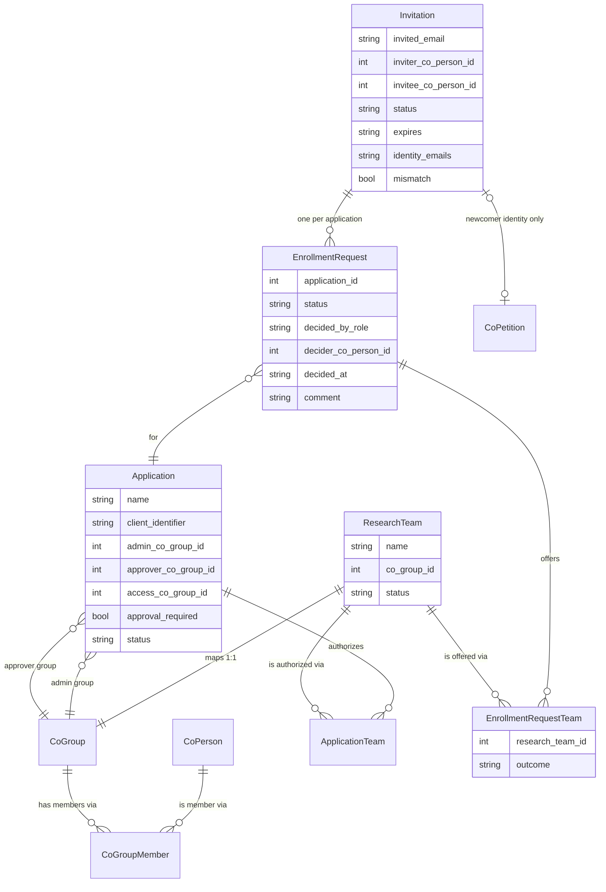
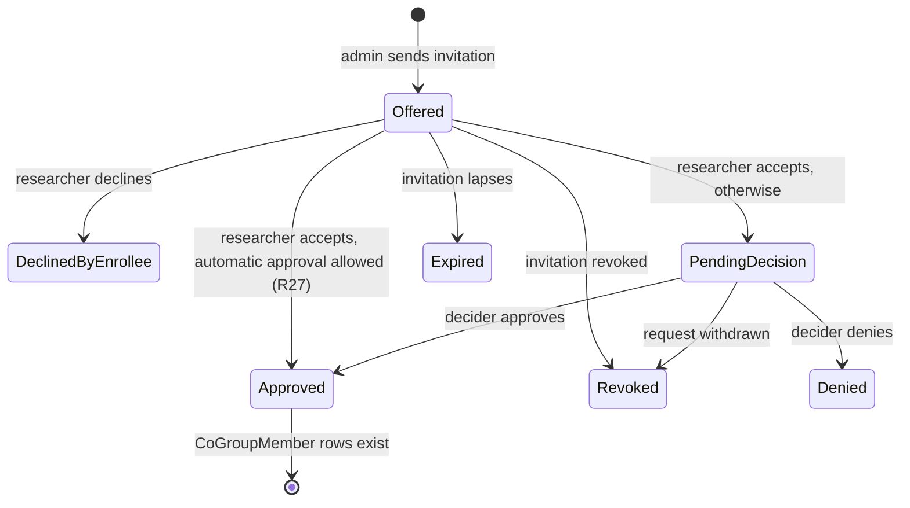
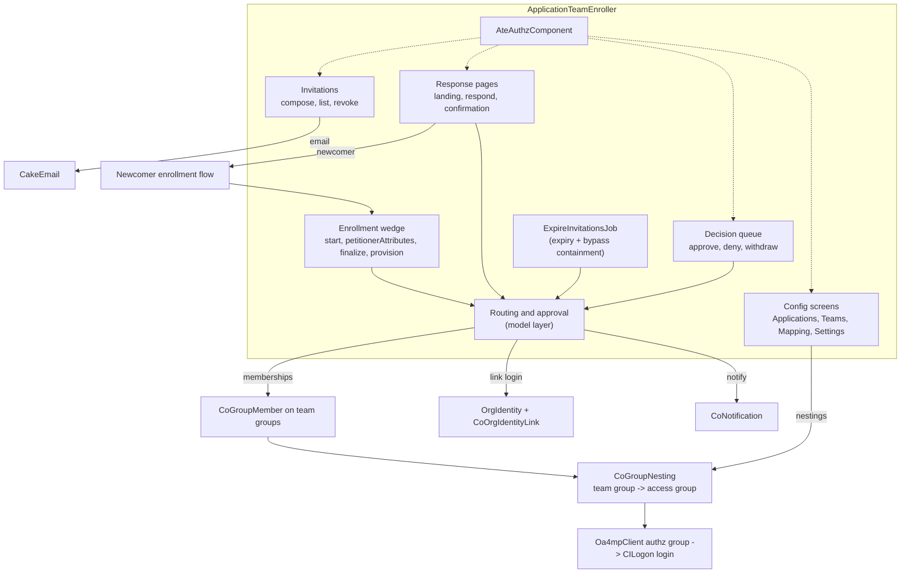
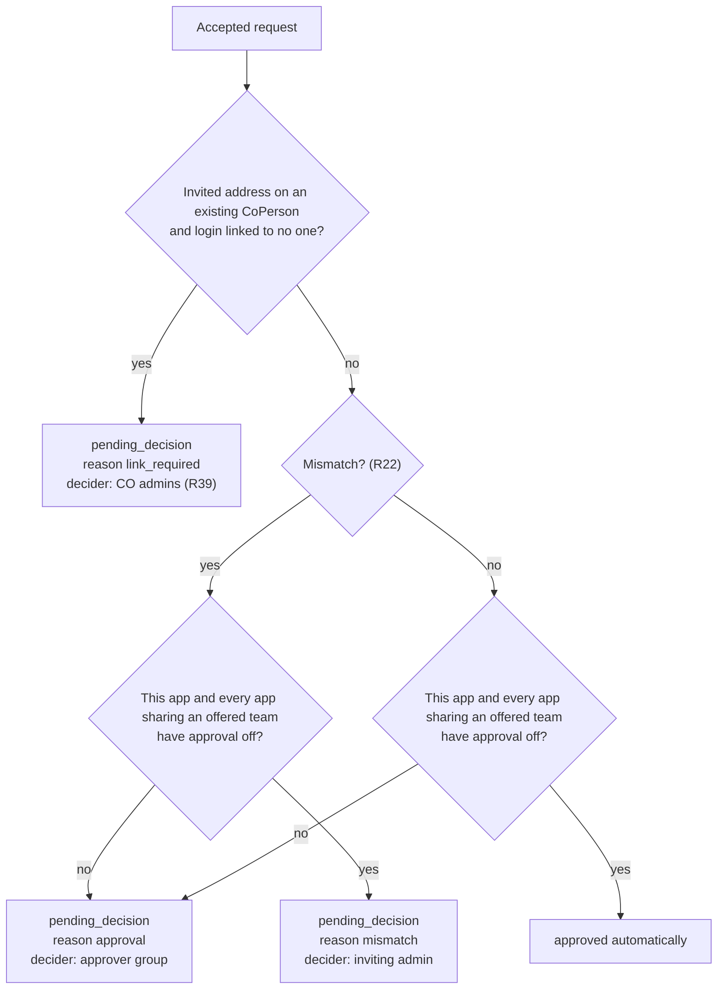
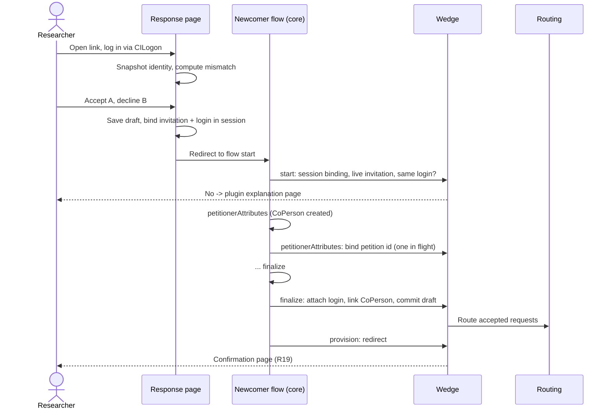

# ApplicationTeamEnroller - Plan

## Goal Capsule

- **Objective:** SD4H application administrators can bring a researcher onto one or more applications and research teams with one email invitation, and the researcher can log into those applications through CILogon with the right team claim once each application's decision is made. Every invitation, response, and decision is recorded for audit.
- **Means:** A COmanage Registry 4.6.x plugin named `ApplicationTeamEnroller`, delivered as a working v1 that SD4H staff can use and react to.
- **Product authority:** This Product Contract supersedes the design in `cilogon/drac-policies` `designs/2026-06-01-sd4h-application-enrollment-plugin-requirements.md` at commit `850ac9c`, which already folds in SD4H's edits from `bd0619c`, and adds SD4H's answers from the 2026-08-20 email. Where SD4H has not answered a question, this contract sets a default (listed under Dependencies / Assumptions) instead of waiting. SD4H feedback on the working plugin can change those defaults.
- **Authority:** Product Contract R-IDs win on behavior; Planning Contract KTDs win on mechanism within them; a unit overrides neither.
- **Execution profile:** Deep. Greenfield plugin in this repository, built in dependency order U1-U12; each unit lands as its own commit on a feature branch.
- **Stop conditions:** Stop and ask if the pinned test image is not Registry 4.6.x (U1), if Registry's enrollment flow cannot hand a newcomer back to the plugin with the invitation intact (U9), or if a unit would change a requirement's meaning.
- **Who finishes:** An implementer (`ce-work` or a person) builds and verifies U1-U12. The developer runs the manual end-to-end check on a test Registry, pushes, and merges.
- **Open blockers:** None.

---

## Product Contract

### Summary

`ApplicationTeamEnroller` is an enroller plugin for COmanage Registry 4.6.x.
An application administrator invites a researcher by email to one or more applications, choosing research teams within each.
The researcher logs in through CILogon and accepts or declines each application.
Accepted applications go to that application's approvers, or are approved immediately when the application does not require approval.
Approval adds the researcher to the teams' CoGroups. Each application has a plugin-maintained access group that nests its teams' groups, so Registry's group provisioning delivers application login and the ID Token team claim.

### Problem Frame

SD4H runs about a dozen applications that researchers log into via CILogon, and more will come. Access to each application depends on membership in a research team, and a team can be authorized for several applications. Before a researcher can use an application, someone with authority must vouch that the person belongs to a research team. The application must also learn at login which authorized teams the person belongs to, so it can scope what they see.

Registry has no structure that links "application", "research team", and "the people responsible for who uses an application". Team membership, application authorization, and the team claim are all wired up by hand. That costs manual group administration for every person on every application, and leaves no record of who invited whom, who consented, or who approved.

At SD4H, onboarding starts with the administrator. The application administrator knows about a researcher joining a project before the researcher knows which applications or teams exist. SD4H reviewed an earlier self-service design and replaced it with administrator invitation. They have also said how to handle mistyped addresses, identity email mismatches, and people who are already CO members.

SD4H has left several questions open. The project will answer them by putting a working plugin in front of SD4H staff, not by further abstract design review.

---

### Key Decisions

- **Enrollment is started by the administrator, and researchers have no self-service path.** SD4H chose this in their review; the researcher never browses applications or asserts team membership. Governs R12, R13.
- **The authorization primitive is `CoGroupMember` on a research team's CoGroup.** A team membership grants login to every application that authorizes the team and supplies the team claim, so its effect is CO-wide. Approval through one application therefore grants every application that shares the team, and automatic approval is allowed only when none of those applications requires approval. Governs R26, R27, R31, R32.
- **`ResearchTeam` maps one-to-one to a `CoGroup`, using the UnixCluster plugin's `cmPluginHasMany` technique.** Membership then rides existing LDAP/OIDC group provisioning, so the plugin needs no custom claim code. The plugin is not a `cluster`-type plugin. Governs R2, R6.
- **Each application's login gate is an access group the plugin maintains by nesting its authorized teams' groups.** CILogon's OIDC client configuration (the Oa4mpClient plugin) accepts one authorization group per client and cannot filter the `isMemberOf` claim, so a nested access group is the only way the plugin's application-to-team mapping reaches login. People are never added to it directly. Governs R31, R32.
- **One invitation spans many applications, and each application is decided on its own.** A researcher gets one email; each application gets its own consent and its own decision, so mixed outcomes are normal. Governs R10, R17, R30.
- **The plugin owns invitations, and no person record exists until it is needed.** An invitation lives only in plugin records. An existing member responds with no petition. A newcomer who accepts at least one application goes through an identity-only enrollment flow that creates their `CoPerson`. (session-settled: user-approved -- chosen over Registry's native `CoInvite` invitation: the native flow creates person records at send time and merges duplicates afterwards, which contradicts SD4H's rule to check before creating anything new.) Governs R14, R19, R20, R21.
- **Admins compose invitations on a plugin screen, not inside an enrollment flow.** A petition started by an admin would need an enrollee record before the researcher has responded. (session-settled: user-approved -- chosen over composing inside an admin-run enrollment flow, as `850ac9c` R7 had it: incompatible with plugin-owned invitations.) Governs R9.
- **An identity mismatch is never resolved automatically.** Following SD4H, a mismatch goes to a person who decides, and approval proceeds only if they approve. Governs R22, R23.
- **When approval is off for an application, the inviting admin decides mismatches for it.** (session-settled: user-directed -- chosen over forcing the approver step, routing to CO administrators, or blocking the response: keeps an application with approval off self-contained within its own administrators.) Governs R24.
- **No one decides their own request, and linking a login to an existing person takes a CO administrator.** A responder deciding their own request, or an application's decider linking identities CO-wide, would let one person grant themselves another person's access. (session-settled: user-directed -- chosen over blocking only self-decision, and over leaving the design unchanged: identity linking is a CO-wide act and health-data access needs a second person.) Governs R39.
- **Where SD4H has not answered, the plugin ships with defaults.** SD4H will get better answers by reacting to a working plugin than to more design review. (session-settled: user-directed -- chosen over pausing design and development until SD4H answers the open questions: SD4H can react to working software.) Each default is a setting or an easy change. See Dependencies / Assumptions.
- **The plugin is named `ApplicationTeamEnroller` and is not tied to SD4H.** Nothing in the design is specific to SD4H, and the name follows the CILogon convention of a CamelCase name ending in `Enroller`, with the repository named after the plugin directory. (session-settled: user-approved -- chosen over `Sd4hApplicationEnroller`, `TeamInvitationEnroller`, and `DracApplicationEnroller`: the design is reusable by other COs.)
- **All text is English and translatable.** Every string goes in the plugin's language file, so French can be added later without code changes. (session-settled: user-approved -- chosen over shipping English and French in v1: halves the text to write and review now.) Governs R38.

---

### Actors

- A1. **Researcher (invitee)** -- receives an invitation by email, logs in via CILogon, and accepts or declines each offered application.
- A2. **Application administrator** -- a member of an application's admin group; composes invitations for the applications they administer, sees their status, revokes their own invitations, and decides mismatches for applications that do not require approval.
- A3. **Application approver** -- a member of an application's approver group; approves or denies accepted requests for that application.
- A4. **CO administrator** -- configures applications, research teams, the application-to-team mapping, admin and approver groups, the approval setting, and plugin settings; can see and revoke any invitation.
- A5. **Application (OIDC client)** -- consumes the team claim at login and scopes the session.
- A6. **Registry provisioning and CILogon** -- provisions `CoGroupMember` (including nested membership) to `isMemberOf`, gates each client on its authorization group, and releases group membership as the team claim.

---

### Data Model

The model names below are what the design assumes; planning may rename them.



- `ApplicationTeam` controls which teams an admin may offer for an application and which team groups are nested into the application's access group (R31). It grants no membership to anyone.
- `Invitation.status`: `sent`, `responded`, `revoked`, `expired`.
- `EnrollmentRequest.status`: `offered`, `declined_by_enrollee`, `pending_decision`, `approved`, `denied`, `revoked`, `expired`.
- `EnrollmentRequestTeam.outcome` records, per team, whether a membership was added, was already present, or was skipped because the application no longer authorizes the team (R29).
- Access itself is only ever `CoGroupMember` rows. The plugin's records are the audit trail.



---

### Key Flows

- F1. Compose and send an invitation
  - **Trigger:** An application administrator opens "Invite researcher" from the plugin menu.
  - **Actors:** A2, A1
  - **Steps:** The admin sees only the applications they administer, picks one or more, and picks teams for each from that application's authorized research teams. They enter the researcher's email address and send. The plugin records the invitation, creates one request per application, and emails the researcher a single link.
  - **Outcome:** One `sent` invitation with one `offered` request per application.
  - **Covered by:** R9-R16

- F2. Researcher responds
  - **Trigger:** The researcher follows the link and logs in via CILogon.
  - **Actors:** A1
  - **Steps:** The plugin checks that the invitation is live and runs the identity checks (R22). The researcher sees each application with its teams and accepts or declines each one. An existing member's response is recorded directly. For a newcomer who accepted at least one application, the plugin runs the configured identity-only enrollment flow to create their `CoPerson`, then links it to the invitation. Each accepted request becomes `approved` (automatic approval allowed by R27) or `pending_decision`. Deciders are notified.
  - **Outcome:** The invitation is `responded` and the link stops working. For a newcomer, this happens only once the enrollment flow completes (R21).
  - **Covered by:** R17-R25

- F3. Decide a request
  - **Trigger:** A decider opens the plugin's decision queue.
  - **Actors:** A3, A2 for a mismatch on an application with approval off, or A4 at any time (R24)
  - **Steps:** The decider sees the pending requests they are allowed to decide, each with the details listed in R25. They approve or deny, optionally with a comment. Approval adds memberships (R26-R29). The researcher gets an email with the outcome.
  - **Outcome:** The request is `approved` or `denied`. Other requests on the same invitation are unaffected.
  - **Covered by:** R25-R30, R35

- F4. Login and claim
  - **Trigger:** The researcher logs into application A via CILogon.
  - **Steps:** CILogon permits the login if the researcher is in A's access group, which contains every team A authorizes through nesting. The ID Token carries the researcher's groups, and A scopes the session to the teams it authorizes.
  - **Covered by:** R31, R32

---

### Requirements

**Configuration**

- R1. CO administrators can create, edit, and retire applications. Each application has a name, an optional OIDC client identifier, an admin CoGroup, an approver CoGroup, and an approval-required setting. There is no limit on how many applications a CO can have.
- R2. CO administrators can designate an existing CoGroup as a research team. Each team maps to exactly one CoGroup, and team membership is represented only by `CoGroupMember` rows on that group.
- R3. CO administrators can authorize any number of research teams for each application, and any team for any number of applications.
- R4. An application's admin and approver groups are existing CO groups that the plugin references and never creates. They may be the same group.
- R5. Per-CO plugin settings hold the invitation lifetime (default 14 days), the invitation email subject and body (a default text ships with the plugin), and the enrollment flow used for newcomers.
- R6. The plugin is an `enroller`-type plugin that also provides its own management screens. It does not register or behave as a `cluster`-type plugin.

**Records**

- R7. Each invitation is recorded durably: invited address, inviting admin, resolved `CoPerson` once known, emails the login identity reported, mismatch flag, expiry, and status.
- R8. Each per-application request is recorded durably: application, offered teams, the researcher's response, the decision, who made it and in which role (approver, inviting admin, CO administrator, or automatic), when, and any comment. The record also shows the outcome for each team.

**Composing an invitation**

- R9. Application administrators compose invitations on a plugin screen reachable from the Registry menu.
- R10. One invitation may cover several applications, with one or more teams for each. One request is created per selected application when the invitation is sent.
- R11. An administrator may select only the applications whose admin group they belong to. CO administrators may select any application.
- R12. For each selected application, the team list contains only research teams authorized for that application and never plain CoGroups such as `CO:admins`.
- R13. The researcher does not choose applications or teams. They only accept or decline what the admin offered.
- R14. Sending an invitation creates no `CoPerson`, OrgIdentity, or petition.
- R15. The researcher receives exactly one email per invitation, containing a single link to respond.
- R16. Several live invitations to the same address are allowed and are handled independently.

**Invitation lifetime**

- R17. An invitation expires when the configured lifetime has passed. On expiry, its unanswered requests become `expired`.
- R18. The inviting admin or a CO administrator can revoke an invitation before the researcher responds, which marks its requests `revoked`. They can also withdraw a single `pending_decision` request, which marks it `revoked`. Resending means revoking and sending a new invitation. The link works for a single response only; after a response, revocation, or expiry it shows an explanatory page.

**Responding**

- R19. Responding requires logging in via CILogon. The researcher sees every offered application with its teams and accepts or declines each independently. A researcher decline is recorded as distinct from a decider's denial. After responding, the researcher sees a confirmation page listing each application's resulting state (approved, awaiting a decision, or declined), with no mismatch details.
- R20. A researcher is an existing member when their login identity is already linked to a `CoPerson` in the CO. Their response is recorded against that `CoPerson` with no petition and no new person record.
- R21. For a researcher who is not an existing member, a `CoPerson` is created only if they accept at least one application. It is created through the configured identity-only enrollment flow from their CILogon identity, and gets the email their identity reports, not the invited address. If they decline every application, no person record is created.
  - A newcomer's response is committed, and the link used up, only when the enrollment flow completes and the new `CoPerson` is linked to the invitation. Until then the invitation stays `sent` and the link can be used again.
  - The plugin's step in that flow stops any petition that does not carry a live invitation with at least one accepted application from the same login, so the flow cannot be used to enroll without an invitation.
  - When the invited address belongs to an existing `CoPerson` but the login identity is linked to no one, no `CoPerson` is created at response time and accepted requests become `pending_decision` (R22). Approval, by a CO administrator per R39, links the login identity to that existing `CoPerson` and adds the memberships there; denial creates nothing.
- R22. At response time, the invitation is flagged as a mismatch in either of these cases:
  - The invited address, compared case-insensitively, is not among the emails the login identity reports. This includes an identity that reports no email.
  - The invited address belongs to a different existing `CoPerson` than the responder.
- R23. An accepted request on a flagged invitation is never auto-approved. It becomes `pending_decision` and shows the mismatch to its decider.
- R24. The decider for a pending request is the application's approver group. When the application has approval off and the request is pending only because of a mismatch, the decider is instead the inviting admin, or any member of the application's admin group if the inviting admin is no longer in it. A CO administrator who sent an invitation is its inviting admin. CO administrators can decide any pending request. R39 limits every case above.
- R25. The decision queue lists only the requests the current user may decide. Each shows the researcher, invited address, emails from the login identity, mismatch flag, inviting admin, application, and teams. Approve and deny each accept an optional comment. The plugin enforces that only the eligible decider can act.
- R39. No one may decide a request they responded to, or a request whose approval would link a login to their own `CoPerson`. A request whose approval links a login identity to an existing `CoPerson` (R21) can be decided only by a CO administrator.

**Authorization**

- R26. On approval, the plugin adds a `CoGroupMember` row for the researcher on each offered team's CoGroup where none exists. A team the researcher already belongs to resolves as already-authorized with no duplicate row.
- R27. An accepted request with no mismatch is approved immediately with the effect of R26, and its decider recorded as automatic, only when its application and every other application that authorizes any of its offered teams have approval off. Otherwise it becomes `pending_decision`.
- R28. Denial creates no memberships for that application's teams.
- R29. At approval time, a team that the application no longer authorizes, or that is no longer a research team, is skipped and recorded as skipped. The other teams are still added.
- R30. Requests from one invitation are decided independently. An invitation can end with a mix of approved, denied, declined, and expired requests.
- R31. The plugin creates and maintains an access CoGroup for each application, containing the CoGroup of every research team the application authorizes as a nested group, and keeps the nesting in step with the application-to-team mapping. A CO administrator configures that access group as the application's OIDC client authorization group. People are never added to an access group directly.
- R32. The team claim comes from CoGroup membership through existing provisioning and carries all of the researcher's groups; each application filters it to the teams it authorizes. The plugin does not implement claim release.
- R33. In v1, researchers are removed from teams through Registry's native group membership management. The plugin has no removal screen.

**Visibility and notifications**

- R34. An application administrator can list invitations that include applications they administer, with the status of each request. CO administrators can list all invitations.
- R35. When a request becomes `pending_decision`, its eligible deciders receive a Registry notification, which Registry delivers in the app and by email. The notification is resolved when the request is decided.
- R36. The researcher receives one email for each application decision (approved, denied, or automatic approval). A decider's comment is kept for audit and is not sent to the researcher.
- R37. The inviting admin is notified when a request on their invitation is decided or when the invitation expires unanswered.

**Localization**

- R38. All user-facing text, including the default email text, is in the plugin's language file in English.

---

### Acceptance Examples

- AE1. **Covers R11, R12.** Given admin X administers A but not B, and A authorizes T1 and T2, when X composes an invitation, then only A is selectable and its team list shows T1 and T2 with no administrative groups.
- AE2. **Covers R10, R15, R19, R30.** Given an invitation for A, B, and C, when the researcher accepts A and C and declines B, then they received one email, B records `declined_by_enrollee`, and A and C proceed independently.
- AE3. **Covers R19, R30.** Given the researcher declined B, when A's approver approves and C's approver denies, then the three requests record `approved`, `declined_by_enrollee`, and `denied`, and the audit record tells each apart.
- AE4. **Covers R14, R20, R26.** Given an existing member whose login identity is linked to their `CoPerson` and who is not in T1, when they accept A offering T1 and A's approver approves, then no petition runs, no `CoPerson` is created, and `CoGroupMember(member, T1)` is added. There was no membership between acceptance and approval.
- AE5. **Covers R21.** Given a researcher with no `CoPerson` in the CO, when they decline every application, then no `CoPerson` is created. When they accept at least one application instead, then exactly one `CoPerson` is created through the configured enrollment flow.
- AE6. **Covers R27.** Given C has approval off, when a researcher whose identity reports the invited address accepts C, then C's team memberships are added immediately and no one is asked to decide.
- AE7. **Covers R22, R23, R24.** Given C has approval off and admin X invited `pat@uni.ca`, when the researcher logs in with an identity reporting only `pat@gmail.com` and accepts C, then C becomes `pending_decision` with the mismatch shown, and only X can decide it.
- AE8. **Covers R22, R24.** Given an invitation for A (approval required) and C (approval off) is flagged as a mismatch, when the researcher accepts both, then A's request goes to A's approvers and C's request goes to the inviting admin, and each is decided on its own.
- AE9. **Covers R22.** Given the invited address is on existing `CoPerson` P1, when the researcher responds with a login identity linked to `CoPerson` P2, then the invitation is flagged as a mismatch.
- AE10. **Covers R26.** Given a researcher already in T2 through an earlier approval for A, when an invitation for B offering T2 is approved, then T2 is recorded as already present and no duplicate row is created.
- AE11. **Covers R29.** Given an invitation for A offering T1 and T2, when a CO administrator removes T2 from A before approval and the approver then approves, then T1 is added and T2 is recorded as skipped.
- AE12. **Covers R17, R18.** Given an invitation, when it is revoked or passes its expiry before a response, then its link shows an explanatory page and its requests are `revoked` or `expired`. A new invitation to the same address works normally.
- AE13. **Covers R25.** Given applications A and B with different approver groups, when a request for A is pending, then only members of A's approver group see it in their queue and can act on it.
- AE14. **Covers R31, R32.** Given a researcher is in T1 and T2, and A authorizes T1 but not T2, when they log into A, then the login succeeds through A's access group and A scopes the session to T1. When a CO administrator later removes T1 from A, then T1 is no longer nested in A's access group and the researcher can no longer log into A.
- AE15. **Covers R27.** Given T is authorized for C (approval off) and B (approval required), when a researcher accepts an invitation to C offering T with no mismatch, then the request becomes `pending_decision` for C's approver group instead of being approved automatically.
- AE16. **Covers R21, R22.** Given the invited address belongs to existing `CoPerson` P1, when the researcher responds with a new login identity linked to no one and accepts A, then no `CoPerson` is created. If a CO administrator approves, then the login is linked to P1 and the memberships are added to P1.
- AE17. **Covers R18, R24.** Given a request has been `pending_decision` with no action from A's approvers, when a CO administrator decides it or the inviting admin withdraws it, then it becomes `approved`, `denied`, or `revoked`.
- AE18. **Covers R39.** Given admin X of C (approval off) invites an address on existing `CoPerson` P1 and responds with X's own unlinked login, when the request becomes pending, then X cannot decide it and it appears only in CO administrators' queues. Given X instead responds with a login linked to X's own `CoPerson`, then X cannot decide that request either.

---

### Success Criteria

- The plugin installs and runs on a COmanage Registry 4.6.x deployment and passes its automated tests.
- On a test Registry, SD4H staff can take one invitation end to end: configure applications and teams, send an invitation covering several applications, respond as both an existing member and a newcomer, decide requests including a mismatch, and log into an application that receives the expected team claim.
- Every product behavior an SD4H reviewer is likely to want changed is either a setting or confined to one requirement, so feedback turns into small changes.

---

### Scope Boundaries

**Deferred for later**

- A plugin screen for removing researchers from teams (R33). Removing a membership revokes access across every application that authorizes the team at once.
- French translation (R38).
- Reminder emails for invitations or pending decisions that have not been acted on.
- Per-client filtering of the team claim in CILogon (R32), which would spare each application from filtering its own claim.

**Outside this plugin's identity**

- Researcher self-service enrollment, where a researcher chooses applications or asserts a team. SD4H removed this path deliberately.
- Per-(application, team) access groups. Team membership is the only access primitive.
- `cluster`-type behavior, `ClusterInterface`, or account provisioning.
- OIDC/LDAP claim-release configuration and CILogon identity matching policy.

---

### Dependencies / Assumptions

**Platform**

- COmanage Registry 4.6.x. The enroller contract is unchanged from 4.5.0 to 4.6.0: the model sets `cmPluginType = "enroller"` and `belongsTo CoEnrollmentFlowWedge`, and the controller extends `CoPetitionsController` with `execute_plugin_<step>($id, $onFinish)`. Unimplemented steps redirect to `$onFinish`.
- `cmPluginHasMany` is keyed by core model name, not plugin type, so a non-cluster plugin can attach `ResearchTeam` to `CoGroup` the way UnixCluster does.
- Plugins can add menu entries through `cmPluginMenus` (as NamespaceAssigner and AnnouncementsWidget do), which supports the management and queue screens.
- CO administrators and group managers can already remove group members in Registry's UI, which is what R33 relies on.
- Registry's native flows cannot be used for this: a flow has a single, static approver group and authorization group, and native invitation processing never compares the invited address with the login identity.
- The Oa4mpClient plugin gives each OIDC client a single authorization group and releases `isMemberOf` without per-client filtering, which is why R31 uses a nested access group and R32 leaves filtering to the application. Registry 4.x supports nested groups (`CoGroupNesting`).

**Assumptions**

- The SD4H CO has, or can be given, an authenticated enrollment flow that builds a `CoPerson` from the CILogon login. The plugin attaches to that flow for newcomers (R21).
- The Registry web server passes the CILogon login's email claims to the plugin's response page as environment variables (Apache `mod_auth_openidc` protecting that path), so R22 can compare them. Where it does not, every response is treated as a mismatch (KTD5).
- Registry's job queue runs from cron on the server, so invitation expiry and its notices happen on schedule (KTD14).

**Defaults SD4H has not confirmed**

Each of these is live in v1 and changes with a setting or within the one requirement named:

- Invitation lifetime of 14 days (R5).
- Admin and approver groups may be the same group (R4).
- An application may have approval turned off (R1, R27).
- For a mismatch on an application with approval off, the inviting admin decides (R24).
- Removal happens only through native group management (R33).
- English only (R38).

**Open for SD4H**

- What an approver checks beyond the admin's choice, and whether approver authority should belong to the research team rather than the application. Today approval through one application grants every application that shares the team (R27 limits only automatic approval).

---

### Sources / Research

- `cilogon/drac-policies` `designs/2026-06-01-sd4h-application-enrollment-plugin-requirements.md`: commit `bd0619c` (SD4H edits) and commit `850ac9c` (reconciled admin-invite model, the baseline for this contract).
- Email "Re: SD4H Application Enrollment Plugin", SD4H to CILogon, 2026-08-20: three cases for trusting the invited address (typo, mismatch, existing CO member).
- `Internet2/comanage-registry` tag `4.6.0`:
  - enroller contract: `app/AvailablePlugin/FiddleEnroller/`; dispatch in `app/Controller/CoPetitionsController.php` lines ~1078-1093
  - static approver and authorization groups: `app/Model/CoEnrollmentFlow.php` lines ~44-50, 482-540
  - native invite: `app/Model/CoInvite.php` (send, processReply)
  - duplicate handling: `app/Model/CoPetition.php` validateIdentifier, `EnrollmentDupeModeEnum`
  - CoGroup mapping: `app/AvailablePlugin/UnixCluster/Model/UnixCluster.php` line ~45; `app/Model/AppModel.php` lines ~143-147
  - menus: `app/AvailablePlugin/NamespaceAssigner/Model/NamespaceAssigner.php` lines ~46-50
- CILogon plugin repository convention: `github.com/cilogon/Access01Enroller` (repository name matches the plugin directory).
- Sibling plugin `cilogon/Oa4mpClient`: its OIDC client has one authorization group (`Config/Schema/schema.xml`, table `oa4mp_client_authorizations`), and its `Test/` harness and `docs/solutions/` learnings shape KTD15.

---

## Planning Contract

**Target:** this repository is the plugin directory itself (`github.com/cilogon/ApplicationTeamEnroller`); it is installed into a Registry as `local/Plugin/ApplicationTeamEnroller`. Paths below are relative to the repository root. Registry references are to `Internet2/comanage-registry` tag `4.6.0` (`app/...`).

**Product Contract preservation:** changed: R21, R24, R39 (new), AE16, AE18 (new) -- no one may decide their own request, and approvals that link a login to an existing `CoPerson` need a CO administrator. User-confirmed during planning after flow analysis found a self-approval path. All other R/A/F/AE IDs and their meaning are unchanged. The "Outstanding Questions / Deferred to Planning" list is resolved by KTD2, KTD5, KTD11, KTD12, KTD14, and KTD15 and was removed.

### Key Technical Decisions

- KTD1. **One plugin that is both an enroller and a job.** The main model declares `cmPluginType = array("enroller", "job")`, enroller first, because Registry's CO duplication reads only the first type (`app/Model/AppModel.php` ~995-999; precedent `app/AvailablePlugin/ApiSource/Model/ApiSource.php:30`). The enroller wedge serves the newcomer flow (R21); the job expires invitations (R17, R37).
- KTD2. **Per-CO settings live in their own model keyed on `co_id`, not on the wedge row.** Registry creates one plugin row per wedge, that is per enrollment flow (`app/Model/CoEnrollmentFlowWedge.php` ~95-107). `AteSetting` hangs off `Co` through `cmPluginHasMany`, is auto-created with persisted defaults on first visit (SponsorManager pattern, `app/AvailablePlugin/SponsorManager/Controller/SponsorManagerSettingsController.php` ~69-96), and holds: invitation lifetime in days (14), invitation email subject and body, the newcomer enrollment flow, the environment variable name(s) carrying login email claims, and the Identifier type used when linking a login (default `oidcsub`). Governs R5.
- KTD3. **Model classes carry an `Ate` prefix.** PHP class names are global across Registry and its plugins, so generic names such as `Application` would collide. Concepts keep their Product Contract names; classes and tables are `AteApplication`, `AteResearchTeam`, `AteApplicationTeam`, `AteInvitation`, `AteEnrollmentRequest`, `AteEnrollmentRequestTeam`, `AteSetting` (tables `cm_ate_*`).
- KTD4. **Invitation links carry 32 random bytes; the database stores only a SHA-256 hash.** Lookup is by hash, so a database read does not yield usable links. `random_bytes` on PHP 8.3 replaces core's `Security::generateAuthKey()` (about 122 bits).
- KTD5. **Identity is snapshotted on the response page and the mismatch check fails closed.** The login identifier is `Auth.User.username`. Login emails come from the configured environment variables (default `OIDC_CLAIM_email`, also checked with Apache's `REDIRECT_` prefix, as `Access01Enroller` does) plus `EmailAddress` rows marked verified on OrgIdentities already linked to that login; unverified rows never count, because petitions and admins can enter them (`app/Model/EmailAddress.php`; core filters on `verified` the same way in `app/Model/CoPetition.php` ~521-535). The snapshot (identifier, type, emails, name if present) is built into the session on the response page and persisted to the invitation only inside the commit transaction, and every commit point requires the current `Auth.User.username` to equal the snapshot identifier, so one login can never commit against another login's snapshot. It is persisted because at decision time the request environment belongs to the decider (`app/Plugin/EnvSource/Model/EnvSourceBackend.php` ~217-236). No email, or any lookup error, counts as a mismatch and the error is logged. Governs R22, R23.
- KTD6. **"Existing member" means the login identifier is a `login = true`, Active `Identifier` on an OrgIdentity linked to a `CoPerson` in this CO.** Such a researcher never gets a second `CoPerson`, whatever that `CoPerson`'s status; the decision queue shows the status so deciders can see it. Governs R20.
- KTD7. **Each pending request stores why it is pending.** `pending_reason` is one of `approval`, `mismatch`, `link_required`, set once at response time. Decider eligibility is computed from it plus current group membership at decision time. Changing an application's approval setting later does not re-route or auto-approve existing requests. Governs R24, R27, R39.
- KTD8. **Every status change is a conditional update inside a transaction.** Transitions update only rows still in the expected status and check the affected-row count, so double submits, two deciders, decide-versus-withdraw, and response-versus-expiry resolve to exactly one winner; the loser sees an "already handled" message. Approval re-checks the application-to-team mapping (R29), adds memberships, and links identities in the same transaction.
- KTD9. **Team memberships are written directly, never through `CoGroupMember::setMembership`.** That method finds any existing row by group and person, including a nesting-derived one, overwrites `owner`, and ignores save failures (`app/Model/CoGroupMember.php` ~727-808); nesting-derived rows are deleted when the source membership ends (~1046-1056). The plugin instead:
  1. records `already_present` when an active direct row exists (`co_group_nesting_id` empty, `member` true, within its validity window);
  2. reactivates an inactive direct row (sets `member` true, clears a past `valid_through`, keeps `owner`);
  3. otherwise inserts a new direct row (`member` true, `owner` false);
  4. checks every save result and writes the same `CoGroupMemberAdded` history record core writes.
  Governs R26.
- KTD10. **Each application's access group is a plugin-created CoGroup whose members arrive only through nesting.** On application creation the plugin creates a Standard, non-open, non-auto group with `nesting_mode_all = false`, named after the application with a numeric suffix on name collision. One `CoGroupNesting` exists per application-to-team row; saving or deleting a mapping row adds or removes it, and a resync action repairs drift. Retiring an application or a team stops it being offered but leaves nestings until mapping rows are removed, so login keeps working. Registry's own UI still allows editing the group; the README states that the plugin owns it. Governs R31.
- KTD11. **Newcomers reach the enrollment flow with a persisted draft and a session binding, and the wedge refuses petitions without one.** The response page saves the newcomer's per-application choices as a draft on the requests and writes the invitation id and login to the session, then redirects into the configured flow. The wedge's `start` step checks that the session binding exists, the invitation is live, the login matches the snapshot, and the draft has an acceptance; otherwise it redirects to a plugin explanation page, because an exception from a plugin step does not stop a petition (`app/Controller/CoPetitionsController.php` ~1086-1102). `petitionerAttributes` binds the petition id to the invitation: it is the first step every newcomer flow runs with a petition id, because `selectEnrollee` is not permitted unless the match policy is Self or Select (`app/Model/CoEnrollmentFlow.php` ~651-664). `finalize` makes sure the new `CoPerson` has an OrgIdentity carrying the snapshot login as an Active `login = true` Identifier of the configured type, creating it with the same helper approval uses (U7) because core attaches the login only when email verification is on (`app/Model/CoEnrollmentFlow.php` ~676-710); it then commits the draft through the routing in KTD7, and `provision` redirects to the plugin's confirmation page. A petition bound while the invitation was live is honored even if it expires mid-flow. Governs R21.
- KTD18. **The wedge's checks are a front door, not a guarantee; the expiry job contains bypasses.** A `done:<wedge id>` named parameter makes Registry skip every plugin step (`app/Controller/CoPetitionsController.php` ~967-1034), so a user can finish the newcomer flow without an invitation. Such a `CoPerson` has no application access, because access comes only through team groups. `ExpireInvitationsJob` also finds `CoPerson` records created by petitions on the configured newcomer flow that no invitation is bound to, suspends them, records a history entry, and notifies the CO admins group. (session-settled: user-directed -- chosen over requiring Registry approval on the newcomer flow with plugin auto-approval, and over documenting the gap only: keeps the flow simple while no application access is exposed.) Governs R21.
- KTD12. **Decider notifications use Registry's `CoNotification` with URL-string sources.** Pending requests notify the approver group (`cogroup`), the inviting admin (`coperson`), or the CO admins group (`CoGroup::adminCoGroupId`), matching `pending_reason`; the notification is resolved by the same URL string when the request is decided, because array sources drop the plugin name (`app/Model/CoNotification.php` ~459-481, 676-705). Action codes use the `p` prefix (`pAPD` pending, `pADC` decided, `pAEX` expired). Governs R35, R37.
- KTD13. **Emails to arbitrary addresses use `CakeEmail('default')` the way `CoInvite::send` does.** Invitation email text comes from `AteSetting` with `(@...)` substitutions; decision emails come from `Lib/lang.php`. In job context the plugin sets `App.base` before building links, as `JobShell` does. Sending the invitation happens inside the create transaction; a send failure rolls back so no unreachable invitation exists. Governs R15, R36.
- KTD14. **Expiry runs as a Registry job and is re-checked on access.** `ExpireInvitationsJob` (listed by `getAvailableJobs`, run through `JobShell` and requeued by `CoJob`) moves lapsed `sent` invitations and their `offered` requests to `expired` and notifies the inviting admin once, tracked by an `expiry_notified` flag. Opening an invitation link applies the same check, so a missed job run never lets a lapsed link be used. Both skip an invitation with a bound newcomer petition until 24 hours past `expires` (KTD11 honors that petition); after the grace window they expire it normally and retire the bound petition. Governs R17, R37.
- KTD15. **The automated test harness is copied from Oa4mpClient.** Docker Postgres plus a pinned Registry image, the checkout bind-mounted as the plugin, `cake database` to apply `Config/Schema/schema.xml`, and a thin console runner because CakePHP 2's `cake test` does not run on PHP 8. The three gates (table-existence check, anchored `ALL_TESTS_PASSED` sentinel, minimum test count) come across from day one. The image digest is adopted only after confirming it runs Registry 4.6.x.
- KTD16. **Authorization lives in one component, and the respond page authorizes on the login alone.** `AteAuthzComponent` computes every permission from `$roles` and group membership (Oa4mpClient's `Oa4mpClientAuthzComponent` pattern). A first-time CILogon user has no `user` role (`app/Controller/Component/RoleComponent.php` ~599-601), so response actions require only `Auth.User.username`. Plugin menu entries in `comain` are shown to every CO member (`app/View/Elements/menuMain.ctp` ~514-534), so each controller enforces access itself. Governs R11, R25, R34.
- KTD17. **The self-decision and identity-link rule is enforced in the authorization component, not in views.** A request is decidable by a user only if they are eligible under KTD7 and are neither the responder's `CoPerson` nor the link target; `link_required` requests are eligible only for CO administrators and are hidden from all other queues. (session-settled: user-directed -- chosen over blocking only self-decision, and over leaving the design unchanged: identity linking is a CO-wide act and health-data access needs a second person.) Governs R39.

### High-Level Technical Design

**Components**



**Response routing** (applied per accepted request at commit time; KTD7 records the outcome)



CO administrators are eligible for every pending request. R39 then removes the responder and the link target from every decider set.

**Newcomer hand-off**



**Data model additions** (beyond the Product Contract's Data Model section)

| Record | Added fields | Why |
|---|---|---|
| `AteApplication` | `access_co_group_id` | KTD10 |
| `AteInvitation` | `token_hash`, `responder_identifier`, `responder_identifier_type`, `responder_name`, `link_target_co_person_id`, `co_petition_id`, `responded_at`, `revoked_by_co_person_id`, `revoked_at`, `expiry_notified` | KTD4, KTD5, KTD11, KTD14, R7 |
| `AteEnrollmentRequest` | `draft_choice`, `pending_reason`, `withdrawn_by_co_person_id` | KTD7, KTD11, R18 |
| `AteSetting` | `co_id`, `invitation_lifetime_days`, `email_subject`, `email_body`, `newcomer_co_enrollment_flow_id`, `email_env_vars`, `login_identifier_type` | KTD2 |

Audit tables (`AteInvitation`, `AteEnrollmentRequest`, `AteEnrollmentRequestTeam`) keep nullable foreign keys and are not cascade-deleted, so deleting a CoGroup or retiring a team never erases history.

### Assumptions

- The newcomer flow is authorized for any authenticated user (`AuthUser`), has no Registry approval step and no email verification, uses a match policy other than Self or Select, and creates an Active `CoPerson`. The settings screen rejects a flow that does not meet this (U4), and the README states it. The plugin attaches the login itself (KTD11).
- Registry creates the newcomer's `CoPerson` at `petitionerAttributes`, before `finalize`. An abandoned flow can therefore leave a Pending `CoPerson`; U9 handles a retry so it neither creates a second `CoPerson` nor routes the researcher as an established member.
- Whether `pAPD`-style four-character action codes collide with other installed plugins is checked during U10; the codes are not a contract.

### Deferred to Implementation

- Exact controller and method names, and the helper that reads OrgIdentity emails for a login.
- Which of Registry's `CoPetition` status transitions best retires an abandoned bound petition (deny versus decline) once U9 exercises a real flow.
- Final wording of lang strings and the default invitation email.

---

## Output Structure

```text
ApplicationTeamEnroller/
  Config/Schema/schema.xml
  Console/Command/AteTestShell.php
  Controller/
    ApplicationTeamEnrollerAppController.php
    ApplicationTeamEnrollersController.php           (wedge config)
    ApplicationTeamEnrollerCoPetitionsController.php  (wedge steps)
    AteApplicationsController.php
    AteResearchTeamsController.php
    AteApplicationTeamsController.php
    AteSettingsController.php
    AteInvitationsController.php
    AteResponsesController.php
    AteEnrollmentRequestsController.php
    Component/AteAuthzComponent.php
  Lib/enum.php
  Lib/lang.php
  Model/
    ApplicationTeamEnroller.php
    ApplicationTeamEnrollerAppModel.php
    AteApplication.php  AteResearchTeam.php  AteApplicationTeam.php
    AteInvitation.php  AteEnrollmentRequest.php  AteEnrollmentRequestTeam.php
    AteSetting.php
    ExpireInvitationsJob.php
  View/ (one directory per controller)
  Test/
    run.sh  README.md  docker/docker-compose.yml
    lib/AteTestCase.php  lib/AteFixtures.php  lib/AteControllerHarness.php
    Case/ (mirrors Model/, Controller/, Lib/)
  .github/workflows/hermetic-tests.yml
  .github/pull_request_template.md
  .gitleaks.toml
  README.md
  CHANGELOG.md
```

---

## Implementation Units

| U-ID | Title | Key files | Depends on |
|---|---|---|---|
| U1 | Plugin skeleton and test harness | `Model/ApplicationTeamEnroller.php`, `Test/run.sh`, `Console/Command/AteTestShell.php` | -- |
| U2 | Schema and models | `Config/Schema/schema.xml`, `Model/Ate*.php`, `Lib/enum.php` | U1 |
| U3 | Authorization component | `Controller/Component/AteAuthzComponent.php` | U2 |
| U4 | Configuration screens and settings | `Controller/AteApplicationsController.php`, `Controller/AteSettingsController.php` | U3 |
| U5 | Access group maintenance | `Model/AteApplication.php`, `Model/AteApplicationTeam.php` | U4 |
| U6 | Compose, send, list, revoke invitations | `Controller/AteInvitationsController.php`, `Model/AteInvitation.php` | U3, U4 |
| U7 | Routing and approval engine | `Model/AteEnrollmentRequest.php` | U2, U5 |
| U8 | Response pages and existing-member responses | `Controller/AteResponsesController.php` | U6, U7 |
| U9 | Newcomer enrollment wedge | `Controller/ApplicationTeamEnrollerCoPetitionsController.php` | U8 |
| U10 | Decision queue, notifications, decision emails | `Controller/AteEnrollmentRequestsController.php` | U7 |
| U11 | Expiry job | `Model/ExpireInvitationsJob.php` | U7, U10 |
| U12 | Operator documentation and end-to-end check | `README.md`, `CHANGELOG.md` | U1-U11 |

### U1. Plugin skeleton and test harness

**Goal:** A loadable, empty enroller-and-job plugin and a green hermetic test suite that proves the plugin loads, its lang strings resolve in console, and its tables exist.

**Requirements:** R6, R38; KTD1, KTD15.

**Dependencies:** none.

**Files:**
- `Model/ApplicationTeamEnroller.php`, `Model/ApplicationTeamEnrollerAppModel.php`
- `Controller/ApplicationTeamEnrollerAppController.php`, `Controller/ApplicationTeamEnrollersController.php`
- `Lib/lang.php`, `Lib/enum.php`
- `View/ApplicationTeamEnrollers/` (wedge edit form, empty fields)
- `Config/Schema/schema.xml` (wedge table only)
- `Test/run.sh`, `Test/README.md`, `Test/docker/docker-compose.yml`, `Test/lib/AteTestCase.php`, `Test/lib/AteFixtures.php`, `Test/lib/AteControllerHarness.php`
- `Console/Command/AteTestShell.php`
- `Test/Case/HarnessSelfTest.php`
- `.github/workflows/hermetic-tests.yml`, `.github/pull_request_template.md`, `.gitleaks.toml`, `.gitignore`

**Approach:**
1. Create the main model with `cmPluginType` per KTD1, `belongsTo CoEnrollmentFlowWedge`, an empty `cmPluginMenus()` for now, and `getAvailableJobs()` returning nothing yet.
2. Create the wedge config controller extending `SEWController` with CO-admin-only permissions (`FiddleEnrollersController` pattern).
3. Copy the Oa4mpClient harness (`Test/run.sh`, `Test/docker/docker-compose.yml`, the thin runner, base test case, fixtures helper, controller harness, `Test/README.md`, CI workflow, gitleaks config, PR template), renaming to `Ate` and dropping the live-server tier. Mount the checkout at `app/Plugin/ApplicationTeamEnroller` inside the container.
4. Run the pinned image once and read its Registry version. Adopt the digest only if it is 4.6.x; otherwise stop (Goal Capsule stop condition) and ask which image to pin.
5. Set the table-existence gate to the `cm_ate_%` prefix and the minimum test count to the self-test count; U2 onward raises it deliberately.

**Patterns to follow:** `app/AvailablePlugin/FiddleEnroller/`; Oa4mpClient `Test/`, `Console/Command/Oa4mpTestShell.php`, `docs/solutions/test-failures/oa4mp-test-runner-silent-pass-count-gate.md`.

**Test scenarios:**
- The runner loads the plugin and `ClassRegistry::init('ApplicationTeamEnroller.ApplicationTeamEnroller')` returns a model whose `cmPluginType` lists `enroller` first.
- `_txt()` on a plugin key returns the English string, not the key, proving `_bootstrap_plugin_txt()` ran.
- The fixtures helper inserts and cleans up a CO, a CoPerson, and a CoGroup.
- `run.sh` fails when the plugin's tables are missing, when the sentinel is absent from the verdict block, and when fewer tests ran than the floor.

**Verification:** `Test/run.sh` ends with the suite-passed line locally, and the CI workflow uses no secrets and pins images by digest.

### U2. Schema and models

**Goal:** All plugin tables and models exist with validation, associations, status enums, and non-cascading audit links.

**Requirements:** R1-R8; KTD2, KTD3, KTD7; Data Model additions table.

**Dependencies:** U1.

**Files:**
- `Config/Schema/schema.xml`
- `Model/AteApplication.php`, `Model/AteResearchTeam.php`, `Model/AteApplicationTeam.php`, `Model/AteInvitation.php`, `Model/AteEnrollmentRequest.php`, `Model/AteEnrollmentRequestTeam.php`, `Model/AteSetting.php`
- `Model/ApplicationTeamEnroller.php` (`cmPluginHasMany` for `Co` and `CoGroup`)
- `Lib/enum.php`
- `Test/Case/Model/SchemaAndAssociationsTest.php`, `Test/Case/Model/AteSettingTest.php`

**Approach:**
1. Define tables per the Product Contract Data Model plus the Planning Contract additions, with changelog columns only on configuration tables (applications, research teams, mapping, settings).
2. Unique constraints: one `AteResearchTeam` per `co_group_id`, one `AteApplicationTeam` per (application, team), one `AteSetting` per `co_id`, unique `token_hash`.
3. `cmPluginHasMany`: `Co` -> `AteSetting`, `AteApplication`; `CoGroup` -> `AteResearchTeam` (not dependent). Registry deletes CoGroups softly and does not null plugin foreign keys (`app/Model/AppModel.php` ~119-160, hard delete disabled), so a team can keep pointing at a deleted group; U7 treats such a team as no longer a research team. Audit tables are not listed, so core deletes never cascade into them.
4. Enums for invitation status, request status, `pending_reason`, `decided_by_role`, team outcome, and notification action codes.
5. `AteSetting` exposes one helper that returns the CO's settings row, creating it with persisted defaults if absent.

**Patterns to follow:** `app/AvailablePlugin/UnixCluster/Model/UnixCluster.php` (`cmPluginHasMany`), `app/AvailablePlugin/SponsorManager/Model/SponsorManager.php`; Oa4mpClient learning on phantom all-null `hasOne` arrays (`docs/solutions/logic-errors/oa4mp-dynamo-config-hasone-phantom-null-array-2026-06-30.md`).

**Test scenarios:**
- Saving a second `AteResearchTeam` for the same CoGroup fails validation.
- Saving a duplicate application-to-team row fails.
- The settings helper creates a row with lifetime 14 for a CO that has none, and a second call returns the same row id.
- Deleting a CoGroup that backs a research team leaves the team row and its `AteEnrollmentRequestTeam` rows in place, and the team is reported as having a deleted group.
- An `AteInvitation` with an unknown status value fails validation.

**Verification:** `cake database` creates every `cm_ate_*` table in the harness; the table-existence floor equals the table count.

### U3. Authorization component

**Goal:** One component answers every "may this user do X" question, including decider eligibility under R24 and R39.

**Requirements:** R11, R18, R24, R25, R34, R39; A2, A3, A4; KTD7, KTD16, KTD17.

**Dependencies:** U2.

**Files:**
- `Controller/Component/AteAuthzComponent.php`
- `Test/Case/Controller/Component/AteAuthzComponentTest.php`

**Approach:**
1. Inputs: `$roles` from `RoleComponent`, the acting `CoPerson` (from `$roles['copersonid']`, not the session), and the object in question.
2. Answers: may configure (CO admin); may invite for application X (admin-group member or CO admin); may view an invitation (inviter, admin of any included application, CO admin); may revoke an invitation or withdraw a request (inviting admin or CO admin); may decide a request (KTD7 eligibility minus R39 exclusions); may respond (authenticated login only).
3. The decider rule follows the stored reason (KTD7), which the routing diagram sets so that a mismatch on a team shared with an approval-required application is `approval`, not `mismatch`: `approval` -> approver group or CO admin; `mismatch` -> inviting admin if still in the admin group, else any admin-group member, or CO admin; `link_required` -> CO admin only. Then remove the responder's `CoPerson` and the link target.

**Patterns to follow:** Oa4mpClient `Controller/Component/Oa4mpClientAuthzComponent.php` and its matrix test; `app/AvailablePlugin/SponsorManager/Controller/SponsorsController.php` `isAuthorized`.

**Test scenarios:**
- Covers AE1. An admin of A but not B may invite for A and not B; a CO admin may invite for both.
- Covers AE13. A member of A's approver group may decide an `approval` request for A and not one for B.
- Covers AE7. For a `mismatch` request on approval-off C, only the inviting admin X (and CO admins) may decide; another admin of C may not while X remains in the group.
- When X leaves C's admin group, any remaining member of C's admin group may decide X's `mismatch` request.
- A mismatch request on C (approval off) whose team T is also authorized for approval-required B is decidable by C's approver group and not by the inviting admin X.
- Covers AE18. The responder's own `CoPerson` may not decide their request even when they are in the approver group or are a CO admin.
- Covers AE18. A `link_required` request is decidable only by CO admins, and not by a CO admin who is the link target.
- A logged-in user with no `CoPerson` in the CO may respond but may not view the queue or invitations.
- A plain CO member may not invite, view invitations, or view the queue.

**Verification:** The matrix test drives real `RoleComponent` against seeded group memberships and passes.

### U4. Configuration screens and settings

**Goal:** CO administrators can manage applications, research teams, the application-to-team mapping, and per-CO settings from the CO configuration page.

**Requirements:** R1-R5, R12; A4; KTD2, KTD3.

**Dependencies:** U3.

**Files:**
- `Controller/AteApplicationsController.php`, `Controller/AteResearchTeamsController.php`, `Controller/AteApplicationTeamsController.php`, `Controller/AteSettingsController.php`
- `View/AteApplications/`, `View/AteResearchTeams/`, `View/AteApplicationTeams/`, `View/AteSettings/` (Registry `fields.inc` plus symlinked `add.ctp`/`edit.ctp` convention)
- `Model/ApplicationTeamEnroller.php` (`cmPluginMenus` `coconfig` entries)
- `Test/Case/Controller/AteSettingsControllerTest.php`, `Test/Case/Model/AteApplicationTest.php`

**Approach:**
1. Standard CRUD controllers with `requires_co`, CO-admin-only permissions from U3, and CoGroup pickers limited to the current CO; research team pickers exclude admin groups and groups already mapped.
2. The mapping screen lives on the application view and offers only active research teams.
3. The settings screen persists defaults on first visit and validates the newcomer flow: it must belong to this CO, be authorized for any authenticated user, have approval and email verification turned off, and use a match policy other than Self or Select, and this plugin's wedge must be attached to it.
4. Edit forms post hidden child ids so saves update rather than insert (Oa4mpClient duplicate-insert learning).

**Patterns to follow:** `app/AvailablePlugin/UnixCluster/Controller/UnixClusterGroupsController.php`; `app/AvailablePlugin/SponsorManager/Controller/SponsorManagerSettingsController.php`; Oa4mpClient `docs/solutions/logic-errors/oa4mp-admin-client-hasone-duplicate-insert-2026-06-30.md`, `docs/solutions/ui-bugs/oa4mp-view-title-double-html-encoding-2026-08-03.md`.

**Test scenarios:**
- Saving settings with a flow that has approval required is rejected with a message naming the problem; a qualifying flow saves.
- Saving settings with a flow from another CO is rejected.
- Saving settings with a flow whose match policy is Self is rejected.
- The research team picker offers neither `CO:admins` nor a group already mapped to a team.
- Editing an application twice leaves exactly one application row.
- A non-admin CO member is denied every configuration action.

**Verification:** A CO admin can create an application, two teams, map them, and save settings in the harness controller tests; manual check that the screens render in a Registry.

### U5. Access group maintenance

**Goal:** Every application has an access group whose nested teams always match its application-to-team mapping.

**Requirements:** R3, R31; AE11, AE14; KTD10.

**Dependencies:** U4.

**Files:**
- `Model/AteApplication.php`, `Model/AteApplicationTeam.php`
- `Controller/AteApplicationsController.php` (resync action)
- `Test/Case/Model/AccessGroupTest.php`

**Approach:**
1. Creating an application creates its access group (KTD10 settings) in the same transaction.
2. Saving a mapping row creates the `CoGroupNesting` from the team's group to the access group; deleting the row deletes the nesting. Core `CoGroupNesting` reconciles derived memberships itself (`app/Model/CoGroupNesting.php` ~88-120).
3. Resync compares mapping rows to nestings on the access group, adds missing ones and removes extra ones, and reports what it changed.
4. Retiring an application or team leaves nestings in place (KTD10).

**Patterns to follow:** `app/Model/CoGroupNesting.php`, `app/Model/CoGroup.php` (programmatic group creation ~236-250).

**Test scenarios:**
- Creating application A creates one access group with any-of nesting and no direct members.
- A name collision with an existing CoGroup yields a suffixed name, not a failure.
- Covers AE14. Mapping T1 to A and adding a person to T1 produces a derived membership in A's access group; removing the mapping removes the derived membership.
- Resync after someone deletes a nesting by hand re-creates it; resync after someone adds an extra nesting removes it.
- Retiring team T1 leaves its nesting in A's access group.

**Verification:** Derived memberships in the harness database match the mapping after every operation.

### U6. Compose, send, list, revoke invitations

**Goal:** Application admins compose one invitation for several applications and teams, the researcher gets one email, and admins can list, revoke, and resend.

**Requirements:** R7, R9-R18, R34; F1; AE1, AE2, AE12; KTD4, KTD13.

**Dependencies:** U3, U4.

**Files:**
- `Controller/AteInvitationsController.php`, `View/AteInvitations/`
- `Model/AteInvitation.php`
- `Model/ApplicationTeamEnroller.php` (`comain` menu entries: Invite researcher, Invitations)
- `Test/Case/Model/AteInvitationTest.php`, `Test/Case/Controller/AteInvitationsControllerTest.php`

**Approach:**
1. The compose form lists only applications the user may invite for and, per application, only its active mapped research teams.
2. On submit the server re-checks every application and team against U3 and the mapping.
3. It creates the invitation, one request per application with its teams, and the token (KTD4), sends the email (KTD13), and commits, all in one transaction.
4. Revoke is a conditional transition (KTD8) from `sent`, recording who revoked and when. Withdraw moves a single `pending_decision` request to `revoked`.

**Patterns to follow:** `app/Model/CoInvite.php` `send` (~287-392) for `CakeEmail` and substitutions.

**Test scenarios:**
- Covers AE2. An invitation for A, B, C creates three `offered` requests and one email whose link contains a token whose hash matches the stored hash.
- A submitted form that includes an application the sender does not administer is rejected server-side, even though the form did not offer it.
- A submitted team that A does not authorize is rejected.
- A mail transport failure leaves no invitation or request rows.
- Covers AE12. Revoking a `sent` invitation marks its requests `revoked`; revoking it again reports it was already handled.
- Two live invitations to the same address can coexist.
- The invitation list shows an admin only invitations that include their applications; a CO admin sees all.

**Verification:** Harness tests pass; manual check that the email arrives with a working link.

### U7. Routing and approval engine

**Goal:** One model-layer service commits responses, routes each accepted request, and carries out approve, deny, and withdraw with all their effects.

**Requirements:** R19-R30, R39; AE3-AE11, AE15-AE17; KTD5-KTD9, KTD17.

**Dependencies:** U2, U5.

**Files:**
- `Model/AteEnrollmentRequest.php`, `Model/AteInvitation.php`, `Model/AteEnrollmentRequestTeam.php`
- `Test/Case/Model/RoutingTest.php`, `Test/Case/Model/ApprovalTest.php`, `Test/Case/Model/MismatchTest.php`

**Approach:**
1. Mismatch evaluation (R22, KTD5) takes a stored identity snapshot and the invited address and returns match, mismatch, or `link_required`. It never needs the current request environment.
2. Committing a response is one conditional transition of the invitation from `sent` to `responded`. It records responder fields and routes each accepted request per the routing diagram, setting `pending_reason` (KTD7).
3. Approve:
   - Re-evaluate the mapping (R29); a team whose CoGroup is deleted counts as no longer a research team.
   - If `link_required`, create an OrgIdentity for the snapshot login with a `login = true` Identifier of the configured type, link it to the target `CoPerson` with a history record, and skip the link if the login is already linked there.
   - Add memberships per KTD9 and record per-team outcomes.
   - All in one transaction.
4. Deny and withdraw are conditional transitions only. Each decision returns what U10 needs for notifications and emails.

**Patterns to follow:** `app/Model/CoPetition.php` ~2294-2318 (raw `CoOrgIdentityLink` save plus `HistoryRecord`), `app/Model/CoGroupMember.php` (`isMember`, `setMembership`, `syncNestedMembership`).

**Execution note:** Implement mismatch evaluation and routing test-first. Build each test fixture with genuinely different emails and different `CoPerson` owners so fixed and broken code disagree (Oa4mpClient `docs/solutions/test-failures/oa4mp-green-run-does-not-prove-a-test-can-fail.md`).

**Test scenarios:**
- Covers AE6. Approval-off C, matching email, active member: the request is `approved` automatically and the team membership exists.
- Covers AE15. T shared by C (approval off) and B (approval required): the request is `pending_decision` with reason `approval`.
- Covers AE7. A snapshot with only a different email on approval-off C: reason `mismatch`.
- A snapshot with no emails is a mismatch. A snapshot whose email lookup failed is a mismatch and logs the error.
- Covers AE9. Invited address on P1, login linked to P2: mismatch.
- Covers AE16. Invited address on P1, login linked to no one: reason `link_required`. Approval creates an OrgIdentity with the login identifier linked to P1, adds memberships to P1, and creates no new `CoPerson`.
- Covers AE4. An existing member approved for T1 gets exactly one direct membership row, with no membership before approval.
- Covers AE10. A researcher already directly in T2 gets outcome `already_present` and keeps their owner flag.
- A researcher in T2 only through nesting still gets a direct T2 membership on approval.
- Covers AE11. T2 unmapped from A before approval: T1 added, T2 `skipped`.
- All teams skipped: the request is `approved` with every team `skipped`, and no identity link is made for `link_required`.
- Covers AE3. Declined, approved, and denied requests on one invitation keep distinct statuses.
- Two approve calls on one request: exactly one succeeds and the other reports it was already decided. Approve against a concurrent withdraw: exactly one wins.
- A mismatch on C (approval off) offering T, where T is also authorized for approval-required B: reason `approval`, not `mismatch`.
- A researcher whose direct T2 row is expired gets it reactivated with `owner` unchanged, and the outcome is `added`.
- A research team whose CoGroup was deleted before approval is `skipped`.
- Changing an application's approval setting after a request is pending leaves the request and its reason unchanged.

**Verification:** Routing, mismatch, and approval tests pass against real `cm_co_group_members`, nesting, and OrgIdentity rows in the harness.

### U8. Response pages and existing-member responses

**Goal:** A researcher follows the link, logs in, sees each offered application, and responds. Existing members finish here; newcomers who decline everything finish here too.

**Requirements:** R14, R19-R23; F2; AE2, AE4, AE5 (decline-all half), AE12; KTD4, KTD5, KTD6, KTD16.

**Dependencies:** U6, U7.

**Files:**
- `Controller/AteResponsesController.php`, `View/AteResponses/` (landing, respond, confirmation, explanation)
- `Lib/AteIdentitySnapshot.php`
- `Test/Case/Controller/AteResponsesControllerTest.php`, `Test/Case/Lib/AteIdentitySnapshotTest.php`

**Approach:**
1. The landing action is reachable without login. It looks up the token hash and applies the expiry check (KTD14). It shows the explanatory page for an unknown, revoked, expired, or already-answered invitation; otherwise it sends the user to login and back.
2. The respond action requires only a login (KTD16). It builds the identity snapshot (KTD5) into the session and shows applications and teams; the snapshot reaches the invitation only when a response commits.
3. On submit:
   - An existing member's response is committed through U7.
   - A newcomer who declined everything is committed with no `CoPerson`.
   - A newcomer who accepted anything goes to U9 (draft plus redirect).
   - A `link_required` responder is committed through U7 with no `CoPerson` creation.
4. The confirmation page lists each application's resulting state without mismatch details (R19).

**Patterns to follow:** `app/Controller/CoInvitesController.php` (`beforeFilter` allow list, `authconfirm`); `Access01Enroller` `Controller/Access01EnrollerCoPetitionsController.php` ~478-490 (reading `REDIRECT_OIDC_CLAIM_email`).

**Test scenarios:**
- An unknown or revoked token shows the explanation page and never reaches the respond action.
- An invitation past its expiry, opened before the job ran, is marked `expired` on access and shows the explanation page.
- The respond action admits a login with no `CoPerson` and no `user` role.
- Covers AE4. An existing member's accept is committed with no petition started and no `CoPerson` created.
- Covers AE5. A newcomer who declines every application is committed and no `CoPerson` exists afterwards.
- Covers AE12. After a response, the same link shows the explanation page.
- A double-submitted response commits once and the second submit sees "already answered".
- The snapshot reads the email from the configured variable and from its `REDIRECT_` form, and collects verified emails from linked OrgIdentities.
- An unverified OrgIdentity email equal to the invited address still yields a mismatch.
- Login A opens the respond page, then login B opens the same link; A's submit is refused because A's session snapshot no longer matches the stored one, or evaluates only A's identity, and never B's.
- The confirmation page shows `approved`, `awaiting a decision`, and `declined` states and never the word "mismatch".

**Verification:** Controller harness tests pass. A manual check behind Apache confirms the email claim is visible to the response page.

### U9. Newcomer enrollment wedge

**Goal:** A newcomer who accepts at least one application gets exactly one `CoPerson` through the configured flow, and the plugin refuses petitions that did not come from a live invitation.

**Requirements:** R21; AE5 (accept half); KTD11.

**Dependencies:** U8.

**Files:**
- `Controller/ApplicationTeamEnrollerCoPetitionsController.php`
- `Controller/AteResponsesController.php` (draft save and redirect into the flow)
- `Test/Case/Controller/ApplicationTeamEnrollerCoPetitionsControllerTest.php`

**Approach:**
1. `execute_plugin_start` enforces KTD11's checks and redirects to the explanation page on failure.
2. `execute_plugin_petitionerAttributes` binds the petition id. If an earlier petition bound to this invitation is still unfinished, it retires that petition before binding the new one, so at most one is in flight.
3. `execute_plugin_finalize`:
   - Reads the enrollee `CoPerson`, attaches the session login to it as an Active `login = true` Identifier of the configured type if it is not already there (KTD11), and links the `CoPerson` to the invitation.
   - Requires the current login to equal the snapshot identifier (KTD5).
   - Commits the draft through U7, honoring a petition bound while live.
   - Re-runs mismatch evaluation against the stored snapshot.
4. `execute_plugin_provision` redirects to the confirmation page.
5. On retry after an abandoned flow, the plugin recognizes a continuing newcomer through the invitation's bound petition and its enrollee `CoPerson`, not through login mapping, and routes them as a newcomer continuing rather than as an existing member.

**Execution note:** Start by running a real petition through the configured flow in the harness or a scratch Registry to confirm the step order and when the `CoPerson` appears. The redirect behavior cannot be proven by unit tests alone, and the Goal Capsule stop condition applies if the hand-back fails.

**Test scenarios:**
- A flow start with no session binding redirects to the explanation page and creates no petition data for the plugin.
- A flow start whose session login differs from the invitation's snapshot login is refused.
- A flow start for a revoked invitation is refused.
- A flow started with `done:<wedge id>` skips the plugin; the test records that the petition is not bound, which U11's containment then handles.
- Covers AE5. A full run for a newcomer who accepted A produces exactly one `CoPerson`, binds it to the invitation, commits the response, and routes A.
- An invitation that expires between `petitionerAttributes` and `finalize` is still honored.
- After a full run with a flow that has no Org Identity Source, the new `CoPerson` resolves as an existing member under KTD6 on the next response.
- Starting the flow a second time while the first petition is unfinished leaves only the newer petition bound and does not produce two active `CoPerson` records.
- Closing the browser mid-flow leaves the invitation `sent`, so the link still works.

**Verification:** A manual end-to-end newcomer run in a test Registry creates one `CoPerson` and lands on the confirmation page; the harness tests pass.

### U10. Decision queue, notifications, decision emails

**Goal:** Deciders see exactly the requests they may decide, act on them, and everyone who should hear about the outcome does.

**Requirements:** R8, R18, R24, R25, R35-R37, R39; F3; AE13, AE17, AE18; KTD12, KTD13, KTD17.

**Dependencies:** U7.

**Files:**
- `Controller/AteEnrollmentRequestsController.php`, `View/AteEnrollmentRequests/`
- `Model/AteEnrollmentRequest.php` (notification and email hooks)
- `Model/ApplicationTeamEnroller.php` (`comain` menu entry: Decision queue)
- `Test/Case/Controller/AteEnrollmentRequestsControllerTest.php`, `Test/Case/Model/NotificationTest.php`

**Approach:**
1. The queue lists pending requests filtered through U3. Each row shows R25's fields plus the researcher's `CoPerson` status (KTD6) and, for `link_required`, the existing person it would link to.
2. Approve and deny take an optional comment and call U7.
3. When a request becomes pending, register a `CoNotification` to its decider set (KTD12); resolve it by source URL on decision or withdrawal.
4. Email the researcher once per decided application, including automatic approvals, and never include the comment. Notify the inviting admin of each decision.

**Patterns to follow:** `app/Model/CoNotification.php` (`register` ~519-640, `resolveFromSource` ~839-880); `app/AvailablePlugin/AnnouncementsWidget/Lib/enum.php` for `p`-prefixed action codes.

**Test scenarios:**
- Covers AE13. A's approver sees A's pending request and not B's.
- Covers AE18. A `link_required` request appears only in CO admins' queues. A CO admin who is the link target does not see it as decidable.
- A user who is not eligible, posting a decision directly, is refused and the request stays pending.
- Covers AE17. A CO admin decides a request that A's approvers ignored. The inviting admin withdraws another request, which becomes `revoked` and its notification is resolved.
- Becoming pending registers one notification to the approver group. Deciding resolves it.
- An automatic approval sends the researcher one email and registers no decider notification.
- The researcher's denial email does not contain the decider's comment.

**Verification:** Harness tests pass; manual check that notifications appear in Registry for a decider and clear after the decision.

### U11. Expiry job

**Goal:** Lapsed invitations expire on schedule and their inviters hear about it once, and people created through the newcomer flow without an invitation are contained.

**Requirements:** R17, R21, R37; AE12; KTD1, KTD14, KTD18.

**Dependencies:** U7, U10.

**Files:**
- `Model/ExpireInvitationsJob.php`
- `Model/ApplicationTeamEnroller.php` (`getAvailableJobs`)
- `Test/Case/Model/ExpireInvitationsJobTest.php`

**Approach:**
1. For the CO it runs in, the job finds `sent` invitations past `expires`, and conditionally moves each invitation and its `offered` requests to `expired`.
2. It notifies the inviter once per invitation (`expiry_notified`) and requeues itself.
3. `pending_decision` requests never expire.
4. An invitation with a bound newcomer petition is skipped until 24 hours past `expires` (KTD14).
5. Containment (KTD18): finalized petitions on the configured newcomer flow since the last run whose id is bound to no invitation have their enrollee `CoPerson` suspended, a history record written, and one notification sent to the CO admins group.

**Patterns to follow:** `app/AvailablePlugin/CoreJob/Model/ExpireJob.php`; `app/AvailablePlugin/ApiSource/Model/PollJob.php`; `app/Console/Command/JobShell.php` (~263-265 for `App.base`).

**Test scenarios:**
- A `sent` invitation one minute past expiry becomes `expired`, with its `offered` requests `expired` and one inviter notification.
- Running the job twice sends no second notification.
- A `pending_decision` request on an old invitation is untouched.
- An invitation answered between the job's read and its update is left `responded`.
- An invitation with a bound petition one minute past expiry is left `sent` with no notice; 25 hours past expiry it is expired and its petition retired.
- A petition finalized on the newcomer flow through the `done:<wedge id>` skip URL, with no bound invitation, leaves its `CoPerson` suspended after the next job run and CO admins notified once.
- A legitimately bound newcomer `CoPerson` is never suspended.

**Verification:** The job runs under `JobShell` in the harness container and the tests pass.

### U12. Operator documentation and end-to-end check

**Goal:** An operator can install and configure the plugin, and the developer can run the Success Criteria end-to-end check.

**Requirements:** Success Criteria; R31 (Oa4mpClient setup); KTD5, KTD10, KTD14.

**Dependencies:** U1-U11.

**Files:**
- `README.md`
- `CHANGELOG.md`

**Approach:** The README covers:
- installation
- the newcomer-flow requirements (from Planning Contract Assumptions)
- Apache protection of the response path, so email claims reach it
- cron for the job queue
- setting each application's access group as its Oa4mpClient authorization group
- the rule that the plugin owns access groups
- that CO membership alone grants no application access, and that the job suspends people who enroll through the newcomer flow without an invitation (KTD18)
- the SD4H defaults and where to change them

It ends with a manual end-to-end checklist that walks the second Success Criterion.

**Test expectation:** none -- documentation only; the end-to-end checklist is run by hand.

**Verification:** A reader who has not seen this plan can configure a test Registry from the README and complete the checklist.

---

## Verification Contract

| Check | Command or procedure | Applies to | Pass signal |
|---|---|---|---|
| Hermetic suite | `Test/run.sh` (Docker) | U1-U11 | Final line reports suite passed, sentinel inside the verdict block, test count at or above the floor |
| PHP syntax | `php -l` on every changed PHP file | All units | No syntax errors |
| CI | `.github/workflows/hermetic-tests.yml` on the pull request | All units | Green run; "no checks reported" counts as red |
| Red proof | Temporarily break the rule a new test guards and watch only that test fail | U3, U7, U9 | Each new rule test is shown able to fail |
| Manual end-to-end | README checklist on a Registry 4.6.x test deployment behind CILogon | U8, U9, U10, U12 | All Success Criteria steps complete, including login to an application through its access group |

## Definition of Done

- Every unit's Verification holds and every Verification Contract row passes.
- Every R-ID and AE-ID that affects implementation is covered by a unit test scenario or the manual end-to-end checklist.
- The test-count floor in `Test/run.sh` equals the number of tests in the suite.
- No abandoned-attempt code, debug output, or unused files remain in the diff.
- `README.md` and `CHANGELOG.md` describe the shipped behavior, and all user-facing text lives in `Lib/lang.php`.
- Per unit: its tests exist, pass, and were shown red where the Verification Contract requires it.
